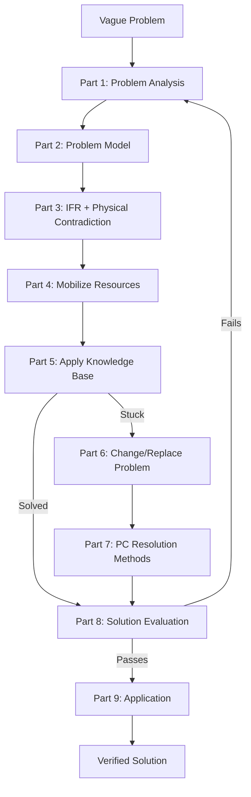
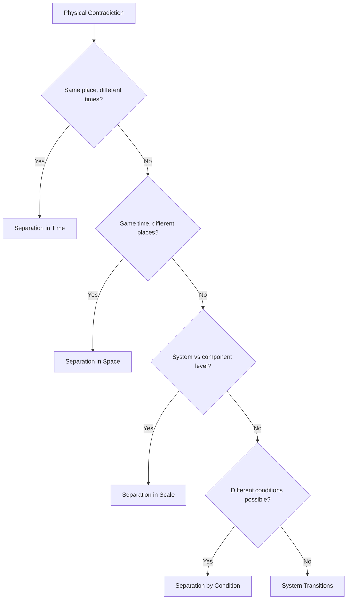

# ARIZ-85C: Algorithm of Inventive Problem Solving

ARIZ (Algoritm Resheniya Izobretatelskikh Zadach) is the most structured process in TRIZ. Developed by Genrich Altshuller through decades of refinement, ARIZ-85C is the definitive version for complex problems that resist simpler tools.

**When to use ARIZ**: Problems where the contradiction is not obvious, where simpler tools (matrix, 40 principles) have failed, or where the problem itself is poorly defined.

---

## Flowchart Overview



---

## Part 1: Problem Analysis

Transform the vague situation into a precisely formulated mini-problem.

### Steps

1.1. **Define the mini-problem**
- State the system's primary useful function
- State the undesirable effect (or what needs to be achieved)
- Formulate: "It is necessary to [achieve X] while preventing [harmful Y] with minimal changes to the system"

1.2. **Define the conflicting pair**
- Identify the two elements in direct conflict
- One is the **tool** (the element we can change)
- One is the **product** (the element being processed)

1.3. **Define the graphical scheme of the conflict**
- Draw the useful action (solid arrow) and harmful action (wavy arrow) between tool and product

1.4. **Choose which conflict to resolve**
- Select the conflict that, if resolved, delivers the primary useful function

1.5. **Intensify the conflict**
- Push the conflicting requirement to its extreme
- "What if the tool provides maximum useful action? What harmful effect becomes maximum?"

1.6. **Formulate the problem model**
- State TC-1: "If [tool does X], then [useful effect] but [harmful effect]"
- State TC-2: "If [tool does NOT-X], then [no harmful effect] but [no useful effect]"

1.7. **Check: is it a standard problem?**
- If the problem matches one of the 76 Standard Solutions, apply it directly
- If not, continue to Part 2

### Template

```
SYSTEM: _______________
PRIMARY USEFUL FUNCTION: _______________
TOOL (changeable element): _______________
PRODUCT (element being processed): _______________

TC-1: If [tool property is X], then [useful effect], but [harmful effect]
TC-2: If [tool property is NOT-X], then [no harmful effect], but [no useful effect]

INTENSIFIED CONFLICT: _______________
```

---

## Part 2: Problem Model

Define the operational zone, operational time, and available resources.

### Steps

2.1. **Define the Operational Zone (OZ)**
- The specific spatial area where the conflict occurs
- Be as precise as possible — not "the whole machine" but "the contact surface between X and Y"

2.2. **Define the Operational Time (OT)**
- T1: the time during which the conflict occurs
- T2: the time just before the conflict
- Consider: can we act during T2 to prevent the conflict at T1?

2.3. **Identify Substance-Field Resources (SFR)**
- Resources within the OZ and during OT
- Categories:
  - **In-system**: existing components of the system
  - **External**: environment, waste products, cheap/free resources
  - **Super-system**: resources from surrounding systems
  - **Modified**: resources derived by slight modification of existing ones

### Template

```
OPERATIONAL ZONE: _______________
OPERATIONAL TIME:
  T1 (conflict time): _______________
  T2 (pre-conflict time): _______________

RESOURCES:
  In-system: _______________
  External: _______________
  Super-system: _______________
  Derived/Modified: _______________
```

---

## Part 3: IFR and Physical Contradiction

### Steps

3.1. **Formulate IFR-1** (for TC-1)
- "The [X-element] in the operational zone, during operational time, [provides useful effect] while [self-eliminating harmful effect]"
- Key: the X-element itself solves the problem — no new mechanisms needed

3.2. **Formulate IFR-2** (for TC-2)
- Same format, opposite starting point

3.3. **Intensify IFR**
- "The system does not exist, but its function is performed"
- Push toward the absolute ideal

3.4. **Derive the Physical Contradiction (PC)**
- From IFR-1 and IFR-2, extract: "The element must be [property A] to provide [useful effect], and must be [NOT-A / property B] to prevent [harmful effect]"
- The PC must be about the SAME element, in the SAME zone, at times defined by OT

3.5. **Formulate macro-level PC**
- Physical state of the element: must be [state X] and [state NOT-X]

3.6. **Formulate micro-level PC**
- At the particle/molecular level: particles must be [arranged/moving/oriented in way A] and [in way NOT-A]

### Template

```
IFR-1: The [X-element], by itself, [provides useful effect] without [harmful effect]
IFR-2: The [X-element], by itself, [prevents harmful effect] without [losing useful effect]

PHYSICAL CONTRADICTION:
  The [element] must be [Property A] in order to _______________
  AND must be [Property NOT-A] in order to _______________

MACRO-PC: Must be [state] and [opposite state]
MICRO-PC: Particles must [behavior] and [opposite behavior]
```

---

## Part 4: Mobilize Resources

Use creative modeling to bridge from the abstract physical contradiction to concrete physical mechanisms. The SLC (Smart Little Creatures) technique overcomes psychological inertia by letting you think about what *should* happen before worrying about *how*.

### Steps

4.1. **Apply the "Smart Little Creatures" (SLC) model**
- Imagine the operational zone filled with tiny intelligent beings (like cooperative ants or nanobots)
- These creatures can do anything you ask -- they have no physical limitations
- Ask: "What should the creatures do to simultaneously satisfy BOTH sides of the PC?"
- Sketch or describe their behavior in detail: what do they form? How do they move? When do they change?
- Do NOT think about physics yet -- only think about the desired *behavior*
- **Key rule**: The SLC must work *within* the operational zone and *during* the operational time defined in Part 2

4.2. **Step back from SLC to physics**
- Examine the SLC behavior and ask: "What known physical phenomenon produces this behavior?"
- Translate each SLC action into a physical mechanism:
  - SLC crowd together / spread apart -> thermal expansion/contraction, osmotic pressure
  - SLC form a barrier then dissolve -> phase transition (ice->water), soluble coating
  - SLC become rigid then flexible -> magnetorheological fluid, shape-memory alloy
  - SLC appear then disappear -> cavitation bubbles, evaporation, controlled chemical reaction
  - SLC pass signals to each other -> piezoelectric effect, resonance, electromagnetic coupling
- **Engineering example**: PC says "barrier must be solid (to contain pressure) and must be absent (to allow flow)." SLC form a wall when pressure is high and scatter when flow is needed. Physics translation: ice plug that melts on command (thermal), or magnetorheological fluid that solidifies under magnetic field.
- **Software example**: PC says "data must be accessible (for fast reads) and must be encrypted (for security)." SLC decrypt on-the-fly only for the requesting user. Physics translation: transparent encryption layer that decrypts in memory but persists encrypted at rest.

4.3. **List transformable resources**
- Return to the resource list from Part 2 (in-system, external, super-system, modified)
- For EACH resource, ask: "Can this resource be modified to resolve the PC?"
- Specific transformations to consider:
  - **Change phase**: solid->liquid->gas->plasma->field
  - **Change structure**: monolith->powder->foam->hollow->nested
  - **Change temporal pattern**: continuous->pulsed->intermittent->triggered
  - **Combine**: mix two existing resources to create a new substance
  - **Decompose**: break a resource into its constituent parts
- Can waste products, by-products, or exhaust be repurposed?
- Can the tool or product themselves be modified (not just acted upon)?

4.4. **Consider "nothing" as a resource**
- Void, vacuum, bubbles, foam, hollow structures, porosity
- The absence of substance is often the most available and cheapest resource
- Specific "nothing" resources:
  - **Voids/cavities**: structural lightness with strength (honeycomb)
  - **Bubbles**: insulation, flotation, cushioning, mixing
  - **Foam**: combines solid structure with gas properties
  - **Vacuum**: thermal insulation, prevents oxidation, suction force
  - **Holes/perforations**: selective passage, weight reduction, flexibility

4.5. **Check field resources**
- Fields already present or easily introduced in the OZ:
  - Gravitational (always present)
  - Thermal (temperature gradients)
  - Mechanical (vibration, pressure, acoustic)
  - Electromagnetic (light, radio, magnetic)
  - Chemical (reactions, catalysis)
- Can an existing field be redirected, concentrated, or modulated?

### Resource Mobilization Checklist

- [ ] SLC model completed -- behavior of creatures clearly described
- [ ] SLC behavior translated to at least one physical mechanism
- [ ] Every resource from Part 2 evaluated for transformability
- [ ] "Nothing" resources considered (void, foam, vacuum, porosity)
- [ ] Available fields inventoried
- [ ] At least one candidate mechanism identified for PC resolution

### Template

\x60\x60\x60
SLC MODEL:
  The tiny creatures in the OZ should: _______________
  When [condition A], they: _______________
  When [condition NOT-A], they: _______________
  The overall behavior pattern is: _______________

PHYSICS TRANSLATION:
  SLC behavior -> Physical phenomenon: _______________
  Specific mechanism: _______________
  Required field/substance: _______________

TRANSFORMABLE RESOURCES:
  Resource 1: _______________ -> can be transformed by _______________
  Resource 2: _______________ -> can be transformed by _______________
  "Nothing" resource: _______________

CANDIDATE MECHANISMS:
  1. _______________
  2. _______________
\x60\x60\x60

---

## Part 5: Apply Knowledge Base

Systematically search the TRIZ knowledge base to find known solutions that match the physical contradiction and the candidate mechanisms identified in Part 4. This is not brainstorming -- it is structured lookup across three databases.

### Steps

5.1. **Check the 76 Standard Solutions**

Apply the standard solutions systematically by class, focusing on those most relevant to the PC:

- **Class 1 (Standards 1-13): Building and destroying Su-Field models**
  - If the system lacks a complete Su-Field (substance-field) model, add the missing element
  - Standard 1.1: If there is no Su-Field, build one (add a field or substance)
  - Standard 1.2: If a Su-Field exists but is ineffective, add a third substance modifier
  - *When to use*: The PC involves insufficient or absent interaction between elements

- **Class 2 (Standards 14-36): Developing Su-Field models**
  - Transition to chain models, dual models, or introduce ferromagnetic substances + magnetic fields
  - Standard 2.1: Use a chain Su-Field (add an intermediary substance)
  - Standard 2.2: Introduce ferromagnetic powder + magnetic field for controllability
  - Standard 2.4: Use field transitions (replace mechanical with thermal, thermal with chemical, etc.)
  - *When to use*: The PC involves needing more control over an existing interaction

- **Class 3 (Standards 37-44): Transition to super-system and micro-level**
  - Combine the system with another system (bi-system, poly-system)
  - Transition to the micro-level (use molecular or field effects instead of mechanical)
  - *When to use*: The PC cannot be resolved at the current system level

- **Class 4 (Standards 45-57): Measurement and detection problems**
  - Replace direct measurement with a copy or model
  - Use resonance, field changes, or additive substances for detection
  - *When to use*: The PC involves measuring, detecting, or monitoring

- **Class 5 (Standards 58-76): Introducing substances and fields under restrictions**
  - Standard 5.1: Introduce substances indirectly (as a coating, mixture, or temporary additive)
  - Standard 5.2: Introduce fields from existing resources (use waste heat, existing vibration, etc.)
  - Standard 5.3: Use phase transitions as a source of needed properties
  - Standard 5.4: Use self-controlled (self-regulating) effects
  - *When to use*: The PC includes constraints that prevent adding new substances or fields

**How to apply**: For each relevant class, state the PC in Su-Field notation. Identify missing or harmful interactions. Match against the standard transformation pattern.

5.2. **Check the 40 Inventive Principles**

- Identify the improving and worsening parameters from the 39 engineering parameters
- Look up the contradiction matrix intersection to find 2-4 suggested principles
- For EACH suggested principle, attempt a concrete application to the PC:
  - State the principle name and number
  - Describe specifically how it would apply to the operational zone
  - Evaluate whether it resolves BOTH sides of the PC
- Common high-value principles to check even if the matrix does not suggest them:
  - #1 Segmentation, #2 Taking out, #10 Preliminary action, #13 The other way round
  - #15 Dynamics, #17 Another dimension, #25 Self-service, #28 Mechanics substitution
  - #35 Parameter changes, #36 Phase transitions, #40 Composite materials

5.3. **Check the Effects Database**

Systematically search for physical, chemical, and geometric effects that could implement the candidate mechanisms from Part 4:

**Physical effects** -- organized by function:
| Need | Effects to check |
|------|-----------------|
| Change shape/size | Thermal expansion, magnetostriction, piezoelectric effect, electrostriction, shape-memory effect |
| Generate force/pressure | Osmosis, centrifugal force, electromagnetic force, radiation pressure, cavitation |
| Change state | Phase transitions, sublimation, supercritical fluids, vitrification, crystallization |
| Move/transport | Capillary action, electrophoresis, Marangoni effect, acoustic streaming, dielectrophoresis |
| Heat/cool | Joule heating, Peltier effect, endothermic reactions, adiabatic expansion, microwave absorption |
| Detect/sense | Piezoelectric effect, photoelectric effect, Hall effect, Doppler effect, fluorescence |
| Store/release energy | Phase-change materials, springs, capacitors, chemical bonds, flywheels |

**Chemical effects** -- organized by function:
| Need | Effects to check |
|------|-----------------|
| Create substance | Polymerization, crystallization, precipitation, electrodeposition |
| Remove substance | Dissolution, etching, oxidation, combustion, sublimation, electrolysis |
| Change properties | Catalysis, doping, cross-linking, alloying, surface treatment |
| Generate gas/expansion | Effervescence, decomposition, electrolysis of water, sublimation |
| Bond/join | Adhesion, sintering, vulcanization, welding (ultrasonic, friction) |

**Geometric effects** -- organized by function:
| Need | Effects to check |
|------|-----------------|
| Increase strength | Arch, truss, honeycomb, corrugation, geodesic |
| Allow flexibility | Bellows, living hinge, serpentine path, origami fold |
| Fill/pack efficiently | Nesting, tessellation, fractal geometry, space-filling curves |
| Guide flow | Venturi, spiral, labyrinth, diffuser, nozzle |

**Decision tree for selecting effects**:
1. What physical parameter does the PC demand change? (size, state, position, temperature, force...)
2. Look up that parameter in the tables above
3. For each matching effect, ask: "Can this effect be triggered using resources already in the OZ?"
4. Rank candidates by: (a) uses existing resources, (b) self-regulating, (c) minimal new components

5.4. **If a solution is found** -> go to Part 8
- Document which knowledge base element provided the solution
- Note the specific standard, principle, or effect applied

5.5. **If no solution** -> go to Part 6
- Document which knowledge base elements were checked and why they did not apply
- This record helps avoid revisiting dead ends after reformulation

### Template

\x60\x60\x60
76 STANDARD SOLUTIONS CHECK:
  Relevant class(es): _______________
  Su-Field model of the problem: S1 --[F]--> S2, harmful/insufficient interaction: ___
  Matching standard(s): _______________
  Application to PC: _______________
  Result: [Solved / Partial / Not applicable]

40 INVENTIVE PRINCIPLES CHECK:
  Improving parameter (#): _______________
  Worsening parameter (#): _______________
  Matrix-suggested principles: _______________
  Principle ___: Application: _______________ -> Result: ___
  Principle ___: Application: _______________ -> Result: ___
  Principle ___: Application: _______________ -> Result: ___

EFFECTS DATABASE CHECK:
  Required function: _______________
  Physical effects considered: _______________
  Chemical effects considered: _______________
  Geometric effects considered: _______________
  Most promising effect: _______________
  How it applies: _______________
  Result: [Solved / Partial / Not applicable]

DECISION: [ ] Solved -> Part 8  |  [ ] Not solved -> Part 6
\x60\x60\x60

---

## Part 6: Change or Replace the Problem

When direct resolution fails, the problem formulation itself may be wrong. This part provides systematic techniques for reformulating. The goal is not to give up on the problem but to find a formulation that *can* be solved.

### Steps

6.1. **Apply 9-Windows (System Operator) thinking**

Examine the problem across three system levels and three time frames:

|  | **Past** | **Present** | **Future** |
|--|----------|-------------|------------|
| **Super-system** | What was the super-system before? What constraints existed? | What is the current super-system? What interfaces exist? | What will the super-system become? What trends are emerging? |
| **System** | What was the system before? How was the function performed differently? | What is the current system? (our problem) | What will the system evolve into? What does the S-curve predict? |
| **Sub-system** | What components existed before? What was their state? | What are the current sub-systems? Which ones participate in the conflict? | What will sub-systems evolve into? Micro-level? Field-based? |

- Fill in ALL 9 windows -- even if some seem irrelevant, they often trigger insights
- Look for patterns: does the past sub-system solve the future super-system's problem?
- **Key question per window**: "If this window IS the system, does my PC still exist?"

6.2. **Move to super-system**
- Can the problem be solved at a higher system level?
- Combine the system with another system (bi-system, poly-system)
- Transfer the function to a different system entirely
- Remove the need for the function by changing the super-system's process
- **Example (engineering)**: Instead of making a drill bit that stays cool (PC: must be hard AND must not overheat), change the drilling process to use water-jet cutting -- the super-system eliminates the drill entirely
- **Example (software)**: Instead of making a single database handle both OLTP and OLAP (PC: must be normalized AND denormalized), use a CQRS architecture where two systems each handle one need

6.3. **Move to sub-system**
- Can the problem be solved by modifying a subsystem or zooming to the micro-level?
- Decompose the problematic element into parts that individually do not have the contradiction
- Transition from mechanical to molecular to field level
- **Example**: Instead of a valve that must be open AND closed, use a membrane with molecular-level pores that selectively pass only certain molecules

6.4. **Reformulate the mini-problem**
- Replace "how to do X" with "what needs to happen so X is unnecessary"
- Challenge the original problem statement using these prompts:
  - "Why do we need this function at all?"
  - "What if the harmful effect became the useful effect?"
  - "What if the product processed itself?" (self-service)
  - "What if the function were performed in advance?" (preliminary action)
  - "What if the function were never needed?" (trimming the requirement)
- Check whether the original problem statement smuggled in an assumed solution

6.5. **Use the inverse problem**
- Instead of solving the original problem, solve its opposite
- "How would I maximally INCREASE the harmful effect?" -- then reverse that mechanism
- "How would I prevent the useful effect entirely?" -- then ensure the opposite
- **Example (engineering)**: Instead of "how to prevent pipe corrosion," ask "how to corrode a pipe as fast as possible" -- answers (oxygen, salt water, electric current, stress) reveal the inverse solution (remove oxygen, desalinate, cathodic protection, stress-relieve)
- **Example (software)**: Instead of "how to prevent memory leaks," ask "how to create the worst memory leak" -- answers (circular references, global caches, no cleanup) point directly to what needs fixing

6.6. **Apply "problem within a problem" technique**
- If the original PC has a partial solution with a secondary problem, treat the secondary problem as the new primary problem
- Chain of reformulation: Problem A -> partial solution -> Problem B -> solve B
- Often, Problem B is simpler than Problem A

### When to Reformulate vs. When to Persist

| Signal | Action |
|--------|--------|
| All 76 standards checked, none apply | Reformulate -- the model may be wrong |
| Effects database has candidates but none fit OZ resources | Persist -- try transforming resources differently |
| The PC feels "forced" or artificial | Reformulate -- the TC may have been formulated incorrectly |
| Multiple partial solutions exist but none fully resolve | Persist -- combine partial solutions |
| The system is at the end of its S-curve | Reformulate -- move to the next-generation system concept |
| You keep returning to the same dead end | Reformulate -- use 9-Windows to shift perspective |

### Template

\x60\x60\x60
9-WINDOWS ANALYSIS:
  Past super-system: _______________
  Past system: _______________
  Past sub-system: _______________
  Present super-system: _______________
  Present system: _______________ (original problem)
  Present sub-system: _______________
  Future super-system: _______________
  Future system: _______________
  Future sub-system: _______________
  Insight from 9-windows: _______________

REFORMULATION ATTEMPTS:
  Attempt 1 -- Super-system shift:
    New problem statement: _______________
    Does original PC still exist? [Yes / No / Transformed]

  Attempt 2 -- Sub-system zoom:
    New problem statement: _______________
    Does original PC still exist? [Yes / No / Transformed]

  Attempt 3 -- Eliminate the need:
    "Why is this function needed?": _______________
    "What if it were unnecessary?": _______________

  Attempt 4 -- Inverse problem:
    "How to maximize the harm?": _______________
    Reversal insight: _______________

SELECTED REFORMULATION: _______________
REASON: _______________
-> Return to Part 1 with this reformulated problem
\x60\x60\x60

---

## Part 7: Physical Contradiction Resolution

Systematically resolve the physical contradiction using separation methods. Try each method against the PC -- the goal is to find a way for the element to have BOTH contradictory properties by separating the conditions under which each property is needed.

### Primary Separation Methods

**7.1. Separation in Time**
- The element has Property A during time T1 and Property NOT-A during time T2
- The key is that the two requirements apply at different moments, even if in the same place
- **Engineering examples**:
  - Landing gear: exists during takeoff/landing, retracts (disappears) during flight
  - Automotive airbag: absent (does not obstruct) during normal driving, present (inflated) during collision
  - Fuse: conducts electricity normally, melts (breaks circuit) during overload
  - Concrete formwork: rigid during pouring, removed after curing
- **Software examples**:
  - Feature flag: code path active during rollout testing, disabled in production
  - Lazy loading: data absent (saving memory) until accessed, then present (loaded on demand)
  - Cache: data present (fast access) for TTL period, then evicted (freeing memory)
  - Write-ahead log: data written sequentially (fast) during transaction, reorganized (optimized) during compaction
- **How to apply**: Identify whether the two contradictory needs actually occur at different times. If so, design a mechanism to switch the property between T1 and T2. Prefer self-switching mechanisms (e.g., phase transitions triggered by operating conditions).

**7.2. Separation in Space**
- Property A exists in zone Z1 and Property NOT-A in zone Z2
- The key is that the two requirements apply at different locations, even if at the same time
- **Engineering examples**:
  - Pipe: rigid along its length (structural support), flexible at joints (absorbs vibration/thermal expansion)
  - Insulated wire: conductive core (carries current), insulating sheath (prevents short circuits)
  - Aircraft wing: thick at root (structural strength), thin at tip (aerodynamic efficiency)
  - Welding mask: opaque everywhere (eye protection), transparent in viewport (visibility)
- **Software examples**:
  - Database sharding: data distributed across servers (scalability) but each shard is self-contained (consistency)
  - Microservice boundary: tightly coupled within service (performance), loosely coupled between services (independence)
  - Edge computing: computation at edge (low latency) and at cloud (heavy processing) -- different locations for different requirements
  - Memory: hot data in L1 cache (fast), cold data on disk (cheap)
- **How to apply**: Map the OZ in detail. Identify whether different sub-zones have different requirements. If so, differentiate the element properties by location. Use gradients when a sharp boundary is impractical.

**7.3. Separation in Scale (Whole vs Parts)**
- The whole has Property A, individual parts have Property NOT-A (or vice versa)
- Emergent properties: the collection exhibits a property that individual units do not
- **Engineering examples**:
  - Chain: flexible as a whole, each link is rigid
  - Fiberglass: strong and rigid (composite whole), made of flexible glass fibers and soft resin (parts)
  - Sand: flows like a liquid (bulk), each grain is a solid (part)
  - Bubble wrap: cushioning (whole sheet), individual bubbles are pressurized rigid cells (parts)
- **Software examples**:
  - Microservices architecture: resilient as a whole (fault-tolerant), each service can fail independently (fragile parts)
  - RAID array: reliable as a whole (redundancy), each disk is unreliable (individual parts)
  - Ensemble model: accurate as a whole (low bias), each sub-model is weak/inaccurate (parts)
  - Distributed hash table: complete key space (whole), each node stores only a fraction (parts)
- **How to apply**: Ask whether the contradiction is between the behavior of the whole and the behavior of its parts. If the macro-level needs Property A and the micro-level needs NOT-A, design the micro-structure so that the emergent macro-behavior satisfies both. Consider: particles, granules, fibers, mesh, foam, composite layers.

**7.4. Separation by Condition**
- Property A under condition C1, Property NOT-A under condition C2
- Condition = temperature, pressure, pH, electrical/magnetic field, light, concentration, load
- **Engineering examples**:
  - Shape-memory alloy: one shape when cold (martensite), another shape when hot (austenite)
  - Magnetorheological fluid: liquid (flows freely) without magnetic field, semi-solid (resists shear) with magnetic field
  - Photochromic glass: transparent indoors (no UV), dark outdoors (UV present)
  - Dilatant (shear-thickening) fluid: soft and flexible under low stress, rigid under impact
- **Software examples**:
  - Circuit breaker pattern: requests pass through (closed state under normal conditions), requests blocked (open state under failure conditions)
  - Adaptive bitrate streaming: high quality under good bandwidth, low quality under poor bandwidth
  - Graceful degradation: full features under normal load, reduced features under extreme load
  - Auto-scaling: few instances under low demand, many instances under high demand
- **How to apply**: Identify what condition differs between when Property A is needed and when Property NOT-A is needed. Design the element so its property changes in response to that condition. Prefer self-regulating mechanisms where the condition itself triggers the property change (no external controller needed).

### System Transition Methods

**7.5. Phase transitions**
- Use phase changes (solid / liquid / gas / plasma) to switch properties
- Each phase change simultaneously changes multiple properties (density, viscosity, shape, volume, thermal conductivity)
- **Example**: Ice plug in a pipe -- solid to seal, melted to remove. The phase transition is the mechanism AND the switching trigger.
- **Example**: Soldering -- solder is solid (holds joint), liquid when heated (allows repositioning), solid again when cooled (permanent)
- Also consider: amorphous/crystalline transitions, gel/sol transitions, supercritical fluids

**7.6. Combined systems**
- Combine two systems where each provides one required property
- **Bi-system**: two similar systems working together (e.g., binoculars = two telescopes)
- **Poly-system**: many similar systems (e.g., RAID = many disks)
- **System with inverse element**: add an element with the opposite property (e.g., noise-cancelling = sound + anti-sound)
- **Nested system**: one system inside another (e.g., thermos = bottle inside bottle with vacuum between)

**7.7. Transition to micro-level**
- Replace a mechanical system with field interactions
- Substance -> molecules -> atoms -> ions -> fields
- **Example**: Instead of mechanical stirring (paddle), use magnetic stirring (rotating field + magnetic bar)
- **Example**: Instead of physical barriers (walls), use electromagnetic containment (plasma confinement)
- This often resolves contradictions by eliminating the physical element that carries the contradiction

### Combination Strategies

When a single separation method does not fully resolve the PC, combine methods:

| Combination | When to use | Example |
|-------------|-------------|---------|
| Time + Space | Property needed in different places at different times | Scanning electron beam: heats one spot, moves to next |
| Space + Scale | Different zones need different granularity | Graded material: dense at surface, porous at core |
| Condition + Time | Condition changes over time trigger property changes | Self-healing material: crack triggers chemical reaction that repairs |
| Scale + Condition | Parts respond differently to conditions | Bimetallic strip: two metals with different thermal expansion |

### Quantitative Selection Guide

When multiple separation methods could work, rank them by:

1. **Resource efficiency** -- Which method uses the fewest new resources? (Prefer using existing OZ resources)
2. **Controllability** -- Which method gives the best control over the property switching? (Prefer self-regulating)
3. **Reliability** -- Which method has the fewest failure modes? (Prefer passive over active mechanisms)
4. **Ideality** -- Which method adds the fewest new components? (Closer to IFR is better)
5. **Completeness** -- Which method resolves the PC most completely? (No residual compromise)

### Resolution Selection Guide



### Template

```
PC TO RESOLVE:
  Must be [Property A] for: _______________
  Must be [Property NOT-A] for: _______________

SEPARATION IN TIME:
  Can requirements be separated in time? [Yes / No]
  T1 (needs Property A): _______________
  T2 (needs Property NOT-A): _______________
  Switching mechanism: _______________
  Assessment: _______________

SEPARATION IN SPACE:
  Can requirements be separated in space? [Yes / No]
  Zone Z1 (needs Property A): _______________
  Zone Z2 (needs Property NOT-A): _______________
  Boundary design: _______________
  Assessment: _______________

SEPARATION IN SCALE:
  Is this a whole-vs-parts difference? [Yes / No]
  Whole behavior: _______________
  Parts behavior: _______________
  Micro-structure design: _______________
  Assessment: _______________

SEPARATION BY CONDITION:
  Are conditions different when each property is needed? [Yes / No]
  Condition C1 (needs Property A): _______________
  Condition C2 (needs Property NOT-A): _______________
  Responsive mechanism: _______________
  Assessment: _______________

SYSTEM TRANSITIONS:
  Phase transition applicable? _______________
  Combined system applicable? _______________
  Micro-level transition applicable? _______________

SELECTED METHOD: _______________
COMBINATION (if needed): _______________
SOLUTION MECHANISM: _______________
IDEALITY SCORE (1-5): ___
-> Proceed to Part 8
```

---

## Part 8: Solution Evaluation

Rigorously evaluate candidate solutions before accepting them. A solution that introduces worse secondary problems than the original is not a solution. This part provides structured evaluation, comparison of multiple candidates, and scoring.

### Steps

8.1. **Verify PC resolution**
- Does the solution resolve the physical contradiction completely?
- Both properties must be achieved -- not a compromise or trade-off
- Test: state specifically how Property A is achieved AND how Property NOT-A is achieved
- If the solution is a compromise (partially A, partially NOT-A), it is NOT a TRIZ solution -- return to Part 7

8.2. **Check controllability**
- Does the solution contain at least one element that is well-controlled?
- Can the key mechanism be turned on, turned off, and adjusted?
- Prefer self-controlling solutions (the system regulates itself) over externally controlled ones
- Rate: [Self-controlling / Easily controlled / Difficult to control / Uncontrollable]

8.3. **Check against the 9 Laws of Technical System Evolution**
- [ ] **Law of Completeness**: Does the system have all necessary parts (engine, transmission, working organ, control)?
- [ ] **Law of Energy Conductivity**: Is energy transmitted efficiently to the working zone?
- [ ] **Law of Harmonization of Rhythms**: Are frequencies, periods, and oscillations of parts coordinated?
- [ ] **Law of Increasing Ideality**: Does the solution move toward more function with less cost/harm?
- [ ] **Law of Uneven Development**: Does the solution address the weakest subsystem?
- [ ] **Law of Transition to Super-system**: Is the solution compatible with super-system evolution?
- [ ] **Law of Transition from Macro to Micro**: Does the solution use micro-level mechanisms where appropriate?
- [ ] **Law of Increasing Substance-Field Involvement**: Does the solution use more effective fields?
- [ ] **Law of Increasing Dynamism and Controllability**: Is the solution more dynamic/flexible than the original?

8.4. **Identify secondary problems**
- List every new problem the solution introduces
- For each secondary problem, classify severity:
  - **Minor**: easily resolved with known methods, does not affect primary function
  - **Moderate**: requires additional design work but is solvable
  - **Major**: could negate the benefits of the solution -- requires ARIZ treatment
- If major secondary problems exist, either: (a) solve them with ARIZ as sub-problems, or (b) return to Part 7 for a different approach

8.5. **Check resource usage**
- Does the solution use available resources (from Part 2) or does it require importing new ones?
- Score: [Uses only existing / Requires minimal additions / Requires significant new resources]
- Solutions using only existing resources are strongly preferred

8.6. **Check real-world analogues**
- Is there a real-world analogue, patent, or prior implementation?
- If yes: study it for implementation insights and failure modes
- If no: the solution may be highly innovative (Level 4-5) -- verify feasibility more carefully

8.7. **Rate the inventive level**
- **Level 1** (32% of inventions): Routine -- uses well-known methods within the specialty. ~10 solutions considered.
- **Level 2** (45% of inventions): Minor improvement -- resolves a minor contradiction within the field. ~100 solutions considered.
- **Level 3** (19% of inventions): Significant improvement -- resolves a contradiction within the field using cross-domain knowledge. ~1,000 solutions considered.
- **Level 4** (4% of inventions): New concept -- resolves contradiction using principles from outside the field. ~100,000 solutions considered.
- **Level 5** (<0.3% of inventions): Discovery -- based on a new principle or phenomenon. ~1,000,000 solutions considered.

### Multi-Solution Comparison Framework

When multiple candidate solutions exist, compare them systematically:

| Criterion | Weight | Solution A | Solution B | Solution C |
|-----------|--------|------------|------------|------------|
| PC Resolution completeness | 25% | | | |
| Ideality (function / cost+harm) | 20% | | | |
| Resource efficiency | 15% | | | |
| Controllability | 15% | | | |
| Secondary problems severity | 15% | | | |
| Implementation feasibility | 10% | | | |
| **Weighted Total** | 100% | | | |

Score each criterion 1-5:
- 5 = Excellent (fully resolves, uses no new resources, self-controlling, no secondary problems)
- 4 = Good (resolves well, minimal new resources, easily controlled, minor secondary problems)
- 3 = Adequate (resolves with minor compromise, some new resources, controllable, moderate secondary problems)
- 2 = Poor (partial resolution, significant new resources, hard to control, major secondary problems)
- 1 = Unacceptable (does not resolve, requires major new subsystems, uncontrollable, creates worse problems)

### Risk Assessment Checklist

- [ ] **Technical risk**: Is the underlying physical/chemical effect well-proven?
- [ ] **Scale risk**: Will the effect work at the required scale (not just lab-bench)?
- [ ] **Reliability risk**: What are the failure modes? What happens when the mechanism fails?
- [ ] **Manufacturing risk**: Can the solution be produced with available processes?
- [ ] **Integration risk**: Does the solution fit into the existing super-system?
- [ ] **Safety risk**: Does the solution introduce new hazards?
- [ ] **Cost risk**: Is the solution economically viable at production volume?
- [ ] **Time risk**: Can the solution be implemented within the required timeline?

### Template

```
SOLUTION UNDER EVALUATION: _______________

PC RESOLUTION:
  Property A achieved by: _______________
  Property NOT-A achieved by: _______________
  Complete resolution? [Yes / Compromise / No]

CONTROLLABILITY: [Self-controlling / Easily controlled / Difficult / Uncontrollable]

EVOLUTION LAWS CHECK:
  Completeness: [Pass / Fail] ___
  Energy conductivity: [Pass / Fail] ___
  Harmonization: [Pass / Fail] ___
  Ideality: [Pass / Fail] ___
  Uneven development: [Pass / Fail] ___
  Super-system transition: [Pass / Fail] ___
  Macro to micro: [Pass / Fail] ___
  Substance-field: [Pass / Fail] ___
  Dynamism: [Pass / Fail] ___

SECONDARY PROBLEMS:
  1. _______________ [Minor / Moderate / Major]
  2. _______________ [Minor / Moderate / Major]
  Action: [Accept / Solve with ARIZ / Return to Part 7]

RESOURCE USAGE: [Existing only / Minimal additions / Significant additions]

INVENTIVE LEVEL: [1 / 2 / 3 / 4 / 5]

RISK ASSESSMENT:
  Technical: [Low / Medium / High] ___
  Scale: [Low / Medium / High] ___
  Reliability: [Low / Medium / High] ___
  Integration: [Low / Medium / High] ___

OVERALL SCORE (1-5): ___
DECISION: [ ] Accept -> Part 9  |  [ ] Revise -> Part 7  |  [ ] Reformulate -> Part 1
```

---

## Part 9: Application and Development

A verified solution is not the end -- it is the beginning. This part ensures the solution is fully developed, that its secondary effects are managed, that the inventive principle is generalized for reuse, and that a practical implementation path exists.

### Steps

9.1. **Define how the super-system changes**
- Map every upstream and downstream system that the solution touches
- For each connected system, identify:
  - What interface changes are needed?
  - Does the connected system benefit from or resist the change?
  - Are there compatibility constraints (standards, regulations, legacy interfaces)?
- Draw a simple diagram: [Super-system component] -> [Our solution] -> [Super-system component]
- **Engineering example**: A new self-cleaning filter changes the maintenance schedule (upstream), the waste handling process (downstream), and the monitoring system (parallel)
- **Software example**: A new caching layer changes the API response format (upstream clients), the database query patterns (downstream), and the monitoring/alerting rules (parallel)

9.2. **Explore new uses for the solution principle**
- Abstract the solution mechanism from the specific problem
- Ask: "Where else does this same type of contradiction exist?"
- Check at three levels:
  - **Same system**: Are there other contradictions in this system that the same principle resolves?
  - **Same industry**: Do peer systems in the same industry face analogous contradictions?
  - **Other industries**: Does the abstract principle transfer to entirely different domains?
- **Example**: The principle "use phase transition to switch between barrier and passage" applies to ice plugs in pipes, fusible links in fire systems, soluble surgical sutures, temporary construction supports, and in software, to circuit breakers that "melt" under overload

9.3. **Predict and resolve secondary problems**
- For each secondary problem identified in Part 8:
  - Classify: is it a technical contradiction (TC), physical contradiction (PC), or administrative constraint?
  - For TC/PC secondary problems: apply ARIZ (full or abbreviated) to resolve them
  - For administrative constraints: document them as implementation requirements
- Common categories of secondary problems:
  - **Manufacturing**: How to produce the new element or structure?
  - **Control**: How to trigger and regulate the new mechanism?
  - **Maintenance**: How to inspect, repair, or replace the new element?
  - **Transition**: How to migrate from the old system to the new one?
  - **Training**: Who needs to learn new procedures?
- Each resolved secondary problem strengthens the solution

9.4. **Assess maximum capability**
- Determine where the solution sits on the S-curve of evolution:
  - **Birth**: New principle, low performance, high potential -- invest in development
  - **Growth**: Rapidly improving performance -- optimize and expand
  - **Maturity**: Performance approaching limits -- look for next-generation transition
  - **Decline**: Physical limits reached -- prepare for replacement
- Project the solution forward: "If we push this principle to its absolute limit, what does it become?"
- Identify the physical ceiling -- what fundamental law ultimately limits this approach?
- **Maximum capability statement**: "This solution can ultimately achieve ___ before being limited by ___"
- Compare the maximum capability against the long-term need -- is there enough headroom?

9.5. **Document the solution pattern**

Abstract the solution for reuse by documenting it in a standard format:

- **Problem pattern**: The generic type of contradiction (e.g., "element must be present AND absent")
- **Solution pattern**: The generic resolution mechanism (e.g., "phase transition triggered by operating conditions")
- **Key principle**: The inventive principle(s) or standard(s) that were central
- **Domain of applicability**: Under what conditions this pattern works
- **Limitations**: When this pattern does NOT work
- **Related patterns**: Other solution patterns that address similar problems

9.6. **Create implementation plan**
- Break the solution into implementable steps
- For each step, identify:
  - What needs to be done
  - What resources are required
  - What the acceptance criterion is
  - What risks exist and how they are mitigated
- Identify the critical path -- which steps are sequential and which can be parallel
- Define prototype/test stages: concept validation -> component test -> system integration -> field trial

### Implementation Planning Checklist

- [ ] All secondary problems identified and resolution planned
- [ ] Super-system interfaces mapped and changes documented
- [ ] Maximum capability assessed -- sufficient headroom for long-term needs
- [ ] Solution pattern documented for reuse
- [ ] New applications of the principle identified
- [ ] Implementation steps defined with acceptance criteria
- [ ] Prototype/testing stages planned
- [ ] Risk mitigations for each implementation step
- [ ] Training/documentation needs identified
- [ ] Rollback plan exists in case of implementation failure

### Template

```
SOLUTION: _______________

SUPER-SYSTEM IMPACT:
  Upstream changes: _______________
  Downstream changes: _______________
  Parallel system changes: _______________
  Interface modifications needed: _______________

NEW APPLICATIONS:
  Same system: _______________
  Same industry: _______________
  Other industries: _______________

SECONDARY PROBLEMS RESOLUTION:
  Problem 1: _______________
    Type: [TC / PC / Administrative]
    Resolution: _______________
  Problem 2: _______________
    Type: [TC / PC / Administrative]
    Resolution: _______________

MAXIMUM CAPABILITY:
  S-curve position: [Birth / Growth / Maturity / Decline]
  Ultimate limit: _______________
  Limiting factor (physical law): _______________
  Headroom vs. long-term need: [Ample / Sufficient / Tight / Insufficient]

SOLUTION PATTERN:
  Problem pattern: _______________
  Solution pattern: _______________
  Key principle/standard: _______________
  Domain of applicability: _______________
  Limitations: _______________
  Related patterns: _______________

IMPLEMENTATION PLAN:
  Step 1: _______________ | Resources: ___ | Acceptance: ___ | Risk: ___
  Step 2: _______________ | Resources: ___ | Acceptance: ___ | Risk: ___
  Step 3: _______________ | Resources: ___ | Acceptance: ___ | Risk: ___
  Critical path: _______________
  Prototype stages: Concept -> Component -> Integration -> Field trial
  Rollback plan: _______________
```

---

## Quick Reference: ARIZ Decision Points

| After Part | If solved... | If stuck... |
|-----------|-------------|-------------|
| Part 1 | Apply Standard Solutions directly | Continue to Part 2 |
| Part 3 | PC is clear, apply Part 7 methods | Re-examine TC formulation |
| Part 5 | Go to Part 8 evaluation | Go to Part 6 reformulation |
| Part 6 | Return to Part 1 with new problem | Combine with other TRIZ tools |
| Part 7 | Go to Part 8 evaluation | Try different separation method |
| Part 8 | Go to Part 9 application | Return to Part 1 |

---

## Example ARIZ Application Skeleton

```
PROBLEM: [Describe situation]

PART 1 -- PROBLEM ANALYSIS
  System: ___
  Useful function: ___
  Conflicting pair: ___ (tool) vs ___ (product)
  TC-1: If ___, then ___ but ___
  TC-2: If ___, then ___ but ___

PART 2 -- PROBLEM MODEL
  OZ: ___
  OT: T1=___, T2=___
  Resources: ___

PART 3 -- IFR + PC
  IFR: The ___, by itself, ___
  PC: Must be ___ AND must be ___

PARTS 4-5 -- RESOURCES + KNOWLEDGE BASE
  SLC model: ___
  Applicable effects: ___
  Suggested principles: ___

PART 7 -- PC RESOLUTION
  Method: Separation in ___
  Mechanism: ___

PART 8 -- EVALUATION
  [Checklist results]

PART 9 -- APPLICATION
  Secondary problems: ___
  Maximum capability: ___
```
