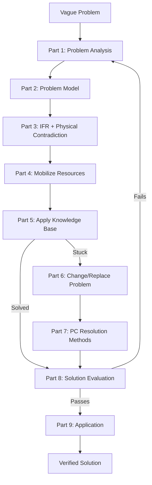
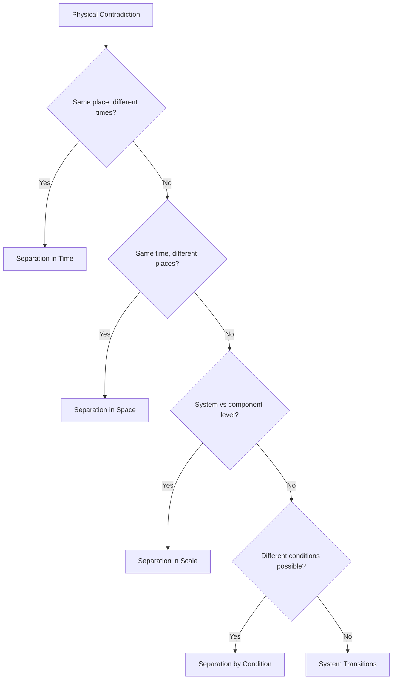

# ARIZ-85C: Algorithm of Inventive Problem Solving

ARIZ (Algoritm Resheniya Izobretatelskikh Zadach) is the most structured process in TRIZ. Developed by Genrich Altshuller through decades of refinement, ARIZ-85C is the definitive version for complex problems that resist simpler tools.

**When to use ARIZ**: Problems where the contradiction is not obvious, where simpler tools (matrix, 40 principles) have failed, or where the problem itself is poorly defined.

---

## Flowchart Overview



---

## Part 1: Problem Analysis

Transform the vague situation into a precisely formulated mini-problem.

### Steps

1.1. **Define the mini-problem**
- State the system's primary useful function
- State the undesirable effect (or what needs to be achieved)
- Formulate: "It is necessary to [achieve X] while preventing [harmful Y] with minimal changes to the system"

1.2. **Define the conflicting pair**
- Identify the two elements in direct conflict
- One is the **tool** (the element we can change)
- One is the **product** (the element being processed)

1.3. **Define the graphical scheme of the conflict**
- Draw the useful action (solid arrow) and harmful action (wavy arrow) between tool and product

1.4. **Choose which conflict to resolve**
- Select the conflict that, if resolved, delivers the primary useful function

1.5. **Intensify the conflict**
- Push the conflicting requirement to its extreme
- "What if the tool provides maximum useful action? What harmful effect becomes maximum?"

1.6. **Formulate the problem model**
- State TC-1: "If [tool does X], then [useful effect] but [harmful effect]"
- State TC-2: "If [tool does NOT-X], then [no harmful effect] but [no useful effect]"

1.7. **Check: is it a standard problem?**
- If the problem matches one of the 76 Standard Solutions, apply it directly
- If not, continue to Part 2

### Template

```
SYSTEM: _______________
PRIMARY USEFUL FUNCTION: _______________
TOOL (changeable element): _______________
PRODUCT (element being processed): _______________

TC-1: If [tool property is X], then [useful effect], but [harmful effect]
TC-2: If [tool property is NOT-X], then [no harmful effect], but [no useful effect]

INTENSIFIED CONFLICT: _______________
```

---

## Part 2: Problem Model

Define the operational zone, operational time, and available resources.

### Steps

2.1. **Define the Operational Zone (OZ)**
- The specific spatial area where the conflict occurs
- Be as precise as possible — not "the whole machine" but "the contact surface between X and Y"

2.2. **Define the Operational Time (OT)**
- T1: the time during which the conflict occurs
- T2: the time just before the conflict
- Consider: can we act during T2 to prevent the conflict at T1?

2.3. **Identify Substance-Field Resources (SFR)**
- Resources within the OZ and during OT
- Categories:
  - **In-system**: existing components of the system
  - **External**: environment, waste products, cheap/free resources
  - **Super-system**: resources from surrounding systems
  - **Modified**: resources derived by slight modification of existing ones

### Template

```
OPERATIONAL ZONE: _______________
OPERATIONAL TIME:
  T1 (conflict time): _______________
  T2 (pre-conflict time): _______________

RESOURCES:
  In-system: _______________
  External: _______________
  Super-system: _______________
  Derived/Modified: _______________
```

---

## Part 3: IFR and Physical Contradiction

### Steps

3.1. **Formulate IFR-1** (for TC-1)
- "The [X-element] in the operational zone, during operational time, [provides useful effect] while [self-eliminating harmful effect]"
- Key: the X-element itself solves the problem — no new mechanisms needed

3.2. **Formulate IFR-2** (for TC-2)
- Same format, opposite starting point

3.3. **Intensify IFR**
- "The system does not exist, but its function is performed"
- Push toward the absolute ideal

3.4. **Derive the Physical Contradiction (PC)**
- From IFR-1 and IFR-2, extract: "The element must be [property A] to provide [useful effect], and must be [NOT-A / property B] to prevent [harmful effect]"
- The PC must be about the SAME element, in the SAME zone, at times defined by OT

3.5. **Formulate macro-level PC**
- Physical state of the element: must be [state X] and [state NOT-X]

3.6. **Formulate micro-level PC**
- At the particle/molecular level: particles must be [arranged/moving/oriented in way A] and [in way NOT-A]

### Template

```
IFR-1: The [X-element], by itself, [provides useful effect] without [harmful effect]
IFR-2: The [X-element], by itself, [prevents harmful effect] without [losing useful effect]

PHYSICAL CONTRADICTION:
  The [element] must be [Property A] in order to _______________
  AND must be [Property NOT-A] in order to _______________

MACRO-PC: Must be [state] and [opposite state]
MICRO-PC: Particles must [behavior] and [opposite behavior]
```

---

## Part 4: Mobilize Resources

### Steps

4.1. **Apply the "Smart Little Creatures" (SLC) model**
- Imagine the operational zone filled with tiny intelligent beings
- What should they do to satisfy both requirements of the PC?
- This bypasses psychological inertia

4.2. **Step back from SLC to physics**
- What physical action corresponds to what the SLC were doing?
- What field or substance could produce this?

4.3. **List transformable resources**
- Which existing resources can be modified to resolve the PC?
- Can waste products be repurposed?
- Can the tool/product themselves be modified?

4.4. **Consider "nothing" as a resource**
- Void, vacuum, foam, hollow structures
- The absence of substance is often the most available resource

---

## Part 5: Apply Knowledge Base

### Steps

5.1. **Check the 76 Standard Solutions**
- Particularly classes 1-3 for substance-field transformations
- Class 4 for measurement/detection problems
- Class 5 for introducing substances under restrictions

5.2. **Check the 40 Inventive Principles**
- Use the contradiction matrix to identify relevant principles
- Apply each suggested principle to the specific PC

5.3. **Check the Effects Database**
- Physical effects (thermal expansion, phase transitions, piezo, etc.)
- Chemical effects (catalysis, oxidation, polymerization, etc.)
- Geometric effects (Moebius, nesting, asymmetry, etc.)

5.4. **If a solution is found** → go to Part 8

5.5. **If no solution** → go to Part 6

---

## Part 6: Change or Replace the Problem

When direct resolution fails, reformulate.

### Steps

6.1. **Move to super-system**
- Can the problem be solved at a higher system level?
- Combine the system with another system

6.2. **Move to sub-system**
- Can the problem be solved by modifying a subsystem?
- Zoom into the micro-level

6.3. **Reformulate the mini-problem**
- Replace "how to do X" with "what needs to happen so X is unnecessary"
- Challenge the original problem statement

6.4. **Use the inverse problem**
- Solve the opposite problem
- What would make the harmful effect maximally useful?

6.5. **Return to Part 1 with reformulated problem**

---

## Part 7: Physical Contradiction Resolution

### Primary Separation Methods

**7.1. Separation in Time**
- The element has Property A during time T1 and Property NOT-A during time T2
- Example: landing gear exists during takeoff/landing, disappears during flight

**7.2. Separation in Space**
- Property A exists in zone Z1 and Property NOT-A in zone Z2
- Example: a pipe is rigid along its length but flexible at joints

**7.3. Separation in Scale (Whole vs Parts)**
- The whole has Property A, individual parts have Property NOT-A
- Example: a chain is flexible (whole) but each link is rigid (part)
- Also: macro-level vs micro-level properties differ

**7.4. Separation by Condition**
- Property A under condition C1, Property NOT-A under condition C2
- Condition = temperature, pressure, pH, field presence, phase state
- Example: shape-memory alloy is one shape when cold, another when hot

### System Transition Methods

**7.5. Phase transitions**
- Use phase changes (solid↔liquid↔gas) to switch properties
- Example: ice plug in a pipe — solid to seal, melted to remove

**7.6. Combined systems**
- Combine two systems where each provides one required property
- Bi-system, poly-system, or system with inverse element

**7.7. Transition to micro-level**
- Replace a mechanical system with field interactions
- Substance → molecules → atoms → fields

### Resolution Selection Guide



---

## Part 8: Solution Evaluation

### Checklist

8.1. Does the solution resolve the physical contradiction?
- [ ] Both properties achieved without compromise

8.2. Does the solution contain at least one element that is well-controlled?
- [ ] The key element can be easily managed

8.3. Was the solution checked against each of the 9 Evolution Laws?
- [ ] Does it move the system toward increased ideality?

8.4. Does the solution introduce new problems?
- [ ] If yes, formulate these as new mini-problems and solve with ARIZ

8.5. Does the solution use available resources (not imported ones)?
- [ ] Prioritizes free, already-present resources

8.6. Is there a real-world analogue or patent?
- [ ] Check existing implementations

8.7. Rate the solution:
- **Level 1**: Routine — uses well-known methods within specialty
- **Level 2**: Minor improvement — resolves minor contradiction
- **Level 3**: Significant improvement — resolves within the field
- **Level 4**: New concept — resolves outside the field
- **Level 5**: Discovery — new principle or phenomenon

---

## Part 9: Application and Development

### Steps

9.1. **Define how the super-system changes**
- What upstream/downstream systems need modification?

9.2. **Explore new uses**
- Can the principle be applied to other problems?

9.3. **Predict secondary problems**
- Identify problems the solution may create
- Apply ARIZ to each secondary problem

9.4. **Assess maximum capability**
- What is the ultimate development of this solution?
- Where does it lead on the S-curve?

9.5. **Document the solution pattern**
- Abstract the solution for reuse
- What class of problems does it solve?

---

## Quick Reference: ARIZ Decision Points

| After Part | If solved... | If stuck... |
|-----------|-------------|-------------|
| Part 1 | Apply Standard Solutions directly | Continue to Part 2 |
| Part 3 | PC is clear, apply Part 7 methods | Re-examine TC formulation |
| Part 5 | Go to Part 8 evaluation | Go to Part 6 reformulation |
| Part 6 | Return to Part 1 with new problem | Combine with other TRIZ tools |
| Part 7 | Go to Part 8 evaluation | Try different separation method |
| Part 8 | Go to Part 9 application | Return to Part 1 |

---

## Example ARIZ Application Skeleton

```
PROBLEM: [Describe situation]

PART 1 — PROBLEM ANALYSIS
  System: ___
  Useful function: ___
  Conflicting pair: ___ (tool) vs ___ (product)
  TC-1: If ___, then ___ but ___
  TC-2: If ___, then ___ but ___

PART 2 — PROBLEM MODEL
  OZ: ___
  OT: T1=___, T2=___
  Resources: ___

PART 3 — IFR + PC
  IFR: The ___, by itself, ___
  PC: Must be ___ AND must be ___

PARTS 4-5 — RESOURCES + KNOWLEDGE BASE
  SLC model: ___
  Applicable effects: ___
  Suggested principles: ___

PART 7 — PC RESOLUTION
  Method: Separation in ___
  Mechanism: ___

PART 8 — EVALUATION
  [Checklist results]

PART 9 — APPLICATION
  Secondary problems: ___
  Maximum capability: ___
```
