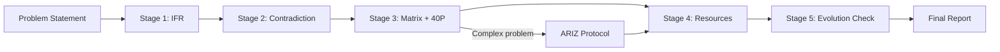

# Full TRIZ Workflow Orchestration

A structured multi-stage pipeline that takes a vague problem through the complete TRIZ methodology. Inspired by TOC's thinking processes (CRT, EC, FRT, PRT, TT), this workflow chains TRIZ tools in a logical sequence with defined handoffs between stages.

---

## Pipeline Overview



---

## Stage 1: Ideal Final Result (IFR)

**Agent**: IFR Agent (Sonnet — fast, good at framing)
**Purpose**: Define the ideal solution before analyzing constraints. This prevents psychological inertia and solution fixation.

### Process

1. **Identify the system and its primary useful function**
   - What does the system exist to do?
   - Who/what is the end user/beneficiary?

2. **Define the Ideal Final Result**
   - "The [system/element] **itself** provides [desired function] without [any costs, harms, or complexity]"
   - The ideal system does not exist — only its function remains

3. **Identify barriers to IFR**
   - What prevents the ideal from being reality today?
   - These barriers become the contradictions for Stage 2

4. **Set direction**
   - Which barrier, if removed, gets closest to IFR?
   - Rank barriers by impact on ideality

### Output Format

```yaml
ifr_analysis:
  system: "description of system under analysis"
  primary_function: "the main useful function"
  ideal_final_result: "The [element] itself [does X] without [Y]"
  barriers:
    - id: B1
      description: "barrier description"
      impact: high|medium|low
    - id: B2
      description: "barrier description"
      impact: high|medium|low
  priority_barrier: "B1"
  direction: "statement of where to focus"
```

---

## Stage 2: Contradiction Analysis

**Agent**: Contradiction Agent (Opus — precise reasoning required)
**Purpose**: Transform barriers into precisely formulated technical and physical contradictions.

### Process

1. **Receive IFR analysis from Stage 1**

2. **For each priority barrier, formulate Technical Contradiction (TC)**
   - TC-1: "If [parameter A improves], then [parameter B worsens]"
   - TC-2: "If [parameter B improves], then [parameter A worsens]"

3. **Map to Altshuller's 39 Parameters**
   - Improving parameter: which of the 39?
   - Worsening parameter: which of the 39?

4. **Derive Physical Contradiction (PC)**
   - "The [element] must be [property X] to [achieve A], and must be [NOT-X] to [achieve B]"
   - Formulate at both macro and micro levels

5. **Classify the contradiction**
   - Administrative (can be solved by management decision)
   - Technical (improving one parameter worsens another)
   - Physical (element must have opposite properties simultaneously)

### Output Format

```yaml
contradiction_analysis:
  source_barrier: "B1 from Stage 1"
  technical_contradictions:
    - id: TC1
      improving: "parameter name (Altshuller #)"
      worsening: "parameter name (Altshuller #)"
      statement: "If [X], then [useful] but [harmful]"
    - id: TC2
      improving: "parameter name (Altshuller #)"
      worsening: "parameter name (Altshuller #)"
      statement: "If [NOT-X], then [useful] but [harmful]"
  physical_contradiction:
    element: "the element in conflict"
    property_required: "must be [X]"
    property_required_not: "must be [NOT-X]"
    macro_pc: "description at system level"
    micro_pc: "description at particle level"
  contradiction_level: "technical|physical"
  matrix_lookup:
    improving_param_number: N
    worsening_param_number: M
```

---

## Stage 3: Principles and Solution Generation

**Agent**: Principles Agent (Opus — creative application of principles)
**Purpose**: Use the contradiction matrix and 40 inventive principles to generate candidate solutions.

### Process

1. **Receive contradiction analysis from Stage 2**

2. **Look up the Contradiction Matrix**
   - Row: improving parameter number
   - Column: worsening parameter number
   - Cell: suggested inventive principles (typically 3-4)

3. **Apply each suggested principle**
   - For each principle, generate at least one concrete solution idea
   - Consider both literal and analogical application
   - Apply the principle at system, subsystem, and supersystem levels

4. **Resolve the Physical Contradiction**
   - Try all four separation methods:
     - Separation in Time
     - Separation in Space
     - Separation in Scale (whole vs parts)
     - Separation by Condition
   - For each that applies, generate a solution concept

5. **Rank solutions by ideality**
   - Ideality = (sum of useful functions) / (sum of costs + sum of harms)
   - Prefer solutions that use existing resources
   - Prefer solutions that eliminate components rather than add them

### Output Format

```yaml
solutions:
  matrix_principles: [P1, P2, P3, P4]
  principle_solutions:
    - principle: "Principle N: Name"
      application: "how this principle applies"
      solution: "concrete solution description"
      ideality_score: 0.0-1.0
  pc_resolution:
    method: "separation in time|space|scale|condition"
    mechanism: "how the PC is resolved"
    solution: "concrete solution description"
  ranked_solutions:
    - rank: 1
      solution_id: "reference"
      description: "solution summary"
      ideality_score: 0.0-1.0
      resources_needed: "what's required"
    - rank: 2
      ...
```

---

## Stage 4: Resource Analysis

**Agent**: Resources Agent (Sonnet — systematic enumeration)
**Purpose**: Find hidden resources already present in or near the system to implement the top solutions.

### Process

1. **Receive top solutions from Stage 3**

2. **Enumerate all available resources in the operational zone**

   | Category | Examples |
   |----------|----------|
   | Substance | Materials, waste, byproducts, environment (air, water) |
   | Field/Energy | Heat, vibration, gravity, electromagnetic, existing flows |
   | Space | Empty spaces, surfaces, interfaces, volumes |
   | Time | Idle periods, pre/post operation, setup time |
   | Information | Data already collected, patterns not yet used |
   | Functional | Unused capabilities of existing components |

3. **Match resources to solutions**
   - For each top solution, identify which resources can implement it
   - Highlight solutions achievable with zero new resources (highest ideality)

4. **Identify "free" resources**
   - Waste products, environmental factors, harmful substances that can be made useful
   - The best TRIZ solutions turn harmful elements into resources

5. **Assess implementation feasibility**
   - Which solutions can be implemented now vs. require development?
   - What is the minimum viable implementation?

### Output Format

```yaml
resource_analysis:
  available_resources:
    substance: ["list"]
    field_energy: ["list"]
    space: ["list"]
    time: ["list"]
    information: ["list"]
    functional: ["list"]
  solution_resource_mapping:
    - solution: "solution 1 from Stage 3"
      resources_used: ["resource A", "resource B"]
      new_resources_needed: ["none" or "list"]
      feasibility: high|medium|low
      implementation_notes: "practical details"
  free_resources_identified:
    - resource: "description"
      current_status: "waste|unused|harmful"
      proposed_use: "how to leverage it"
  recommended_solution:
    description: "the best solution considering resources"
    resources: ["resources it uses"]
    feasibility: high|medium|low
```

---

## Stage 5: Evolution Validation

**Agent**: Evolution Agent (Sonnet — pattern matching against trends)
**Purpose**: Validate the solution against TRIZ's 8 Laws of Technical System Evolution. Ensure the solution moves the system forward, not backward.

### Process

1. **Receive recommended solution from Stage 4**

2. **Check against each Evolution Law**

   | # | Law | Check |
   |---|-----|-------|
   | 1 | Completeness of Parts | Does the solution maintain engine-transmission-tool-control? |
   | 2 | Energy Conductivity | Does energy flow improve through the system? |
   | 3 | Harmonization of Rhythms | Are frequencies/periods of components matched? |
   | 4 | Increasing Ideality | Does ideality increase (more function, less cost/harm)? |
   | 5 | Uneven Development | Does it address the weakest subsystem? |
   | 6 | Transition to Super-system | Does it integrate with or form a larger system? |
   | 7 | Transition to Micro-level | Does it move from macro to micro mechanisms? |
   | 8 | Increasing Dynamism | Does flexibility/controllability increase? |

3. **Identify the system's position on the S-curve**
   - Birth → Growth → Maturity → Decline
   - Solutions for mature systems should focus on transition to next S-curve

4. **Predict next evolution step**
   - Based on the evolution laws, what should the system become next?
   - Does the proposed solution align with this trajectory?

5. **Flag violations**
   - Any evolution law the solution violates is a warning
   - Solutions moving against evolution trends require strong justification

### Output Format

```yaml
evolution_validation:
  evolution_law_checks:
    - law: "Law 1: Completeness"
      status: pass|warning|fail
      note: "explanation"
    - law: "Law 2: Energy Conductivity"
      status: pass|warning|fail
      note: "explanation"
    # ... all 8 laws
  s_curve_position: "birth|growth|maturity|decline"
  predicted_next_step: "what the system should evolve into"
  alignment: "does the solution align with evolution trajectory?"
  warnings: ["any evolution violations"]
  final_verdict: "approved|approved with caveats|reconsider"
```

---

## Handoff Protocol

Each stage passes a structured YAML document to the next. The document accumulates:

```yaml
triz_workflow:
  problem: "original problem statement"
  timestamp: "ISO 8601"

  stage_1_ifr:
    # IFR Agent output
    status: complete

  stage_2_contradiction:
    # Contradiction Agent output
    status: complete

  stage_3_solutions:
    # Principles Agent output
    status: complete

  stage_4_resources:
    # Resources Agent output
    status: complete

  stage_5_evolution:
    # Evolution Agent output
    status: complete
```

### Error Handling

- If any stage cannot produce output, it returns `status: blocked` with a `reason` field
- The orchestrator can:
  - Retry with additional context
  - Skip to the next stage with caveats
  - Route to ARIZ for complex problems (bypasses Stages 3-4)
  - Return to a previous stage with new information

---

## Final Report Template

```markdown
# TRIZ Analysis Report

## Problem
[Original problem statement]

## Ideal Final Result
[IFR from Stage 1]

## Contradictions Identified
### Technical Contradiction
- TC-1: [statement]
- TC-2: [statement]
- Parameters: [improving] vs [worsening]

### Physical Contradiction
- [Element] must be [X] AND [NOT-X]

## Solutions Generated
### From Contradiction Matrix
| # | Principle | Solution Concept | Ideality |
|---|-----------|-----------------|----------|
| 1 | P[N]: [Name] | [description] | [score] |
| 2 | ... | ... | ... |

### From PC Resolution
- Method: Separation in [time/space/scale/condition]
- Solution: [description]

## Recommended Solution
[Best solution with resource analysis]

### Resources Used
- [List of resources, emphasizing free/existing ones]

### Implementation Path
1. [Step 1]
2. [Step 2]
3. [Step 3]

## Evolution Check
- S-curve position: [position]
- Evolution alignment: [yes/no + explanation]
- Predicted next step: [description]

## Warnings and Secondary Problems
- [Any new problems introduced by the solution]
- [Evolution law violations]

## Confidence Assessment
- Contradiction resolution: [clean/partial/workaround]
- Resource utilization: [existing only / some new / significant new]
- Evolution alignment: [aligned/neutral/misaligned]
```

---

## Orchestration Rules

1. **Sequential execution**: Stages 1-5 run in order. Each depends on the previous.
2. **Early termination**: If Stage 1 reveals a simple problem (no real contradiction), skip to solution.
3. **ARIZ escalation**: If Stage 3 fails to resolve the PC, route through full ARIZ protocol (see `ariz-protocol.md`).
4. **Iteration**: The workflow can loop. Stage 5 warnings may send back to Stage 2 for reformulation.
5. **Parallel branching**: Multiple TCs can be processed through Stages 3-5 in parallel, then merged.
6. **Resource-first shortcut**: For implementation-focused problems, start at Stage 4 with a known solution concept.
