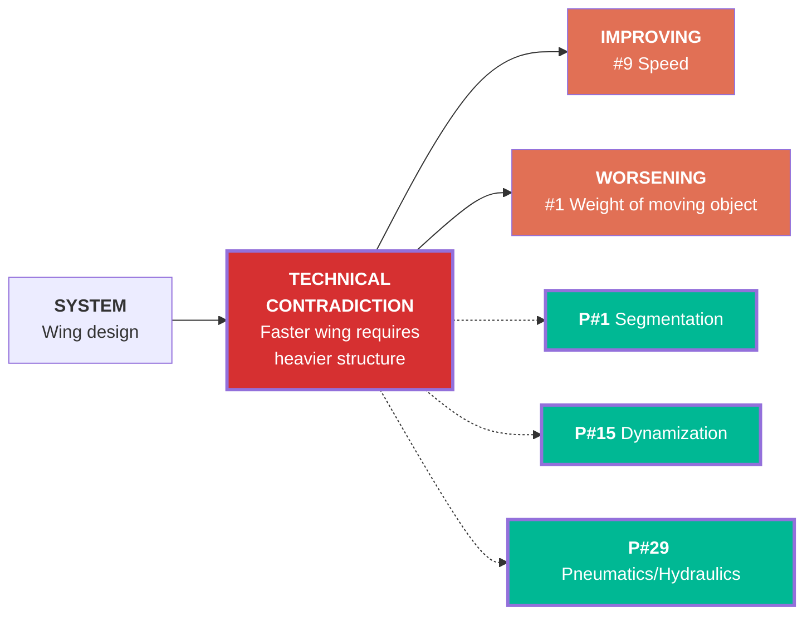
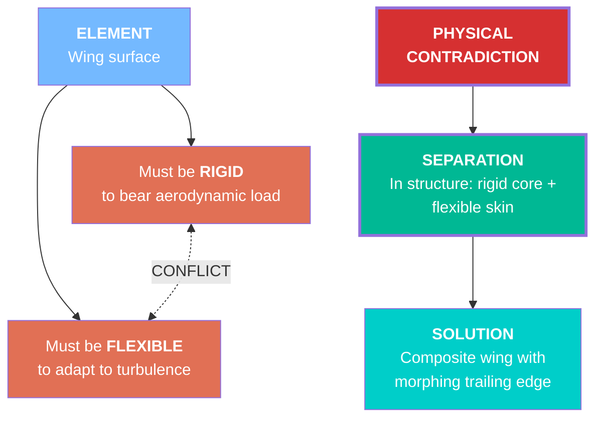
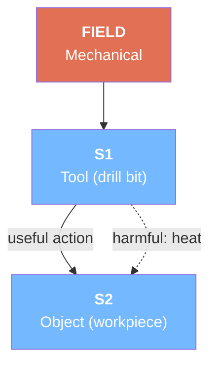
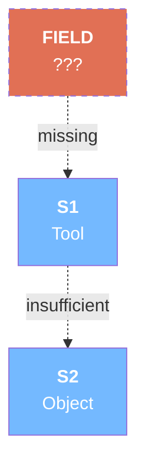
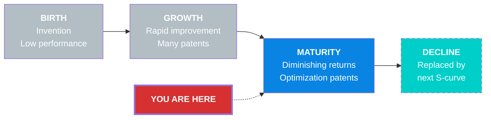
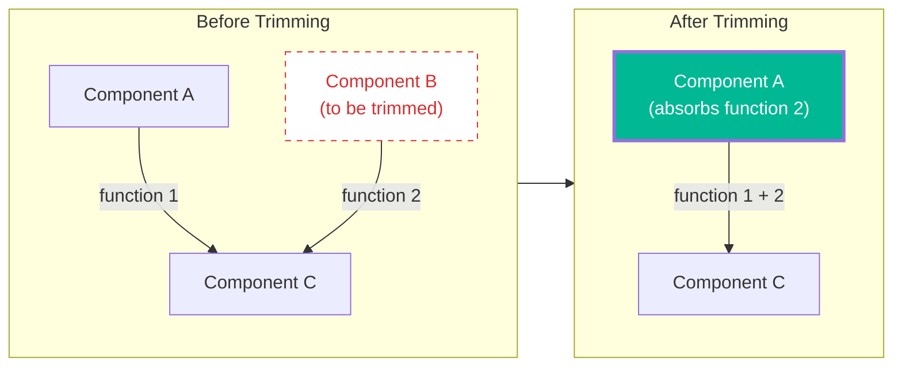
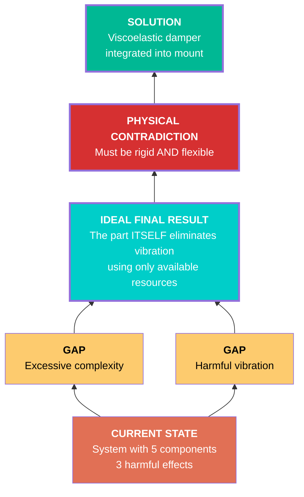
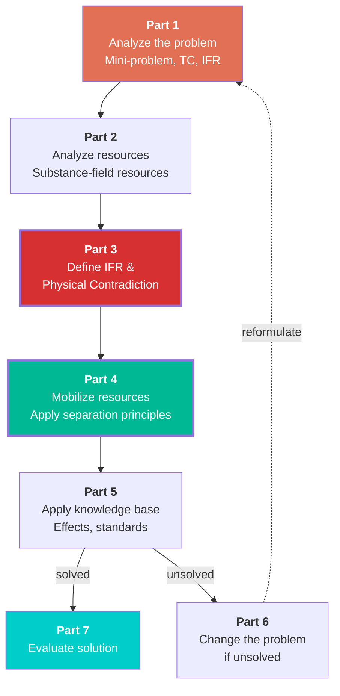
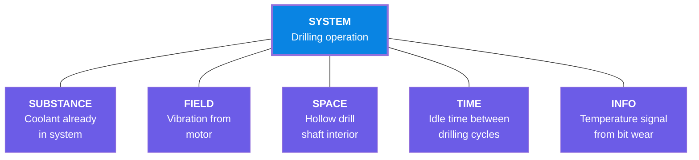

# Output Format Specification

All TRIZ tools render their output in two formats: Mermaid (default) and ASCII.

## Format Selection

- Default: `mermaid` — renders in GitHub, VS Code, and most Markdown viewers
- Alternative: `ascii` — universal text fallback, works everywhere
- Controlled by `--format mermaid|ascii` argument

## Color Conventions (Mermaid)

| Element | Color | Style Code |
|---------|-------|-----------|
| Problem / Contradiction | Coral red | `fill:#e17055,color:#fff` |
| Root Contradiction | Dark red, thick border | `fill:#d63031,color:#fff,stroke-width:3px` |
| Inventive Principle | Green, thick border | `fill:#00b894,color:#fff,stroke-width:3px` |
| Solution / IFR | Teal | `fill:#00cec9,color:#fff` |
| Harmful Effect / Function | Yellow warning | `fill:#fdcb6e,color:#000` |
| Resource | Purple | `fill:#6c5ce7,color:#fff` |
| Substance | Light blue | `fill:#74b9ff,color:#fff` |
| Field | Orange | `fill:#e17055,color:#fff` |
| Useful Function | Default | (no special styling) |
| Evolution Stage (current) | Dark blue | `fill:#0984e3,color:#fff` |
| Evolution Stage (past) | Light gray-blue | `fill:#b2bec3,color:#fff` |
| Evolution Stage (future) | Teal, dashed | `fill:#00cec9,color:#fff,stroke-dasharray:5` |
| AND connector | Gray diamond | `fill:#b2bec3,color:#fff` |
| Trimmed component | Red, dashed border | `fill:#fff,color:#d63031,stroke:#d63031,stroke-dasharray:5` |

## Mermaid Templates

### Technical Contradiction Diagram

Direction: `graph LR` (left-to-right — improving parameter on left, worsening on right)



### Physical Contradiction Diagram

Direction: `graph TB` (top-to-bottom — element at top, opposing requirements below)



### Su-Field Model

Direction: `graph TB` (top-to-bottom — field at top, substances below)



Incomplete Su-Field (problem):


### Evolution S-Curve

Direction: `graph LR` (left-to-right — time progression)



### Trimming — Before and After

Direction: `graph LR` (left-to-right — before on left, after on right)



### Ideal Final Result (IFR)

Direction: `graph BT` (bottom-to-top — current state at bottom, IFR at top)



### ARIZ Flow

Direction: `graph TB` (top-to-bottom — sequential phases)



### Resource Map

Direction: `graph TB` (top-to-bottom — system at center, resources around)



## ASCII Templates

### Technical Contradiction
```
═══ TECHNICAL CONTRADICTION ═══

SYSTEM: Wing design

  IMPROVING: #9 Speed ──────┐
                             ├──→ [TC] Faster wing requires heavier structure
  WORSENING: #1 Weight ─────┘
                               │
                    ┌──────────┴──────────┐
                    ↓          ↓          ↓
               [P#1]      [P#15]     [P#29]
            Segmentation  Dynamize   Pneumatics

Contradiction Pair: #9 vs #1
Suggested Principles: 1, 15, 29
```

### Physical Contradiction
```
═══ PHYSICAL CONTRADICTION ═══

ELEMENT: Wing surface

  Must be RIGID ──────┐
                      ├──→ CONFLICT
  Must be FLEXIBLE ───┘

SEPARATION: In structure
  → Rigid core + flexible skin

SOLUTION: Composite wing with morphing trailing edge
```

### Su-Field Model
```
═══ SU-FIELD MODEL ═══

       [F] Mechanical
        │
        ↓
   [S1] Drill bit ──→ [S2] Workpiece
        │    useful action
        └ ─ ─ ─ ─ ─ → [S2]
             harmful: heat

Type: Complete, with harmful side-effect
Standard Solution: Introduce S3 to absorb harmful effect
```

### Evolution S-Curve
```
═══ EVOLUTION S-CURVE ═══

Performance
    │            ___________
    │           /           \  ← DECLINE
    │          / ← MATURITY  \
    │         /  ★ YOU ARE    \
    │        /    HERE         \
    │       / ← GROWTH          \
    │      /                     \
    │_____/ ← BIRTH               \___
    └──────────────────────────────────→ Time

Stage: MATURITY — diminishing returns, optimize or transition
```

### Trimming
```
═══ TRIMMING ═══

BEFORE:                          AFTER:
┌─────────┐  func1  ┌─────┐    ┌─────────┐  func1+2  ┌─────┐
│    A     │──────→│  C  │    │ A (new) │─────────→│  C  │
└─────────┘        └─────┘    └─────────┘          └─────┘
┌ ─ ─ ─ ─ ┐ func2    ↑
│    B     │──────────┘       B removed — function 2 absorbed by A
└ ─ ─ ─ ─ ┘
  (trimmed)

Components: 3 → 2 (trimmed 1)
Functions preserved: 2/2
```

### Ideal Final Result
```
═══ IDEAL FINAL RESULT ═══

CURRENT STATE: System with 5 components, 3 harmful effects

  [GAP] Excessive complexity
  [GAP] Harmful vibration
       ↓
  [IFR] The part ITSELF eliminates vibration
        using only available resources
       ↓
  [PC]  Must be RIGID and FLEXIBLE
       ↓
  [SOLUTION] Viscoelastic damper integrated into mount

Ideality: +45% (2 components removed, 1 harm eliminated)
```

### ARIZ Flow
```
═══ ARIZ FLOW ═══

Part 1: Analyze Problem
  → Mini-problem → TC → IFR
      ↓
Part 2: Analyze Resources
  → Substance/field resources in zone
      ↓
Part 3: Define IFR + Physical Contradiction
  → "X-element must be ___ and not-___"
      ↓
Part 4: Mobilize Resources
  → Apply separation principles
      ↓
Part 5: Apply Knowledge Base
  → Effects database, 76 standards
      ↓
  solved? ──→ Part 7: Evaluate Solution
  unsolved? → Part 6: Reformulate → back to Part 1
```

### Resource Map
```
═══ RESOURCE MAP ═══

              ┌─────────────────┐
              │     SYSTEM      │
              │  Drilling op.   │
              └───────┬─────────┘
       ┌──────────┬───┴───┬──────────┐
       ↓          ↓       ↓          ↓
  [SUBSTANCE]  [FIELD]  [SPACE]   [TIME]
   Coolant     Vibration  Hollow   Idle
   in system   from motor shaft    cycles

  [INFO] Temperature signal from bit wear

Resources found: 5
Unused resources: 3 (vibration, hollow shaft, idle cycles)
```

## Rendering Rules

1. **Always include a title** — `═══ TOOL NAME ═══` for ASCII, `%% Tool: NAME` comment for Mermaid
2. **Always include a summary** after the diagram with key counts (contradictions, principles, resources, etc.)
3. **Mermaid node IDs** — use short, semantic names (TC1, PC1, IP1, WP1, P1, S1, F1, SOL1, etc.)
4. **Mermaid line breaks** — use `<br/>` for multi-line node text
5. **Bold labels** — use `<b>LABEL</b>` in Mermaid for entity type labels
6. **Conflict arrows** — always dotted: `<-. "CONFLICT" .->`
7. **Harmful function arrows** — always dotted: `-.->|"harmful: description"|`
8. **Suggested principle arrows** — dotted from contradiction to principle: `-.->` 
9. **Normal arrows** — solid: `-->` (confirmed function, causal link)
10. **Missing/incomplete elements** — use `stroke-dasharray:5` for dashed borders
11. **Maximum nodes per diagram** — shallow: 8-12, deep: 15-25. Split into sub-diagrams if needed.
12. **Principle cards** — when listing principles in detail, use this format:

```
┌─────────────────────────────────────┐
│ P#15 DYNAMIZATION                   │
│─────────────────────────────────────│
│ Make object/environment adaptive    │
│ so performance is optimal at        │
│ each operating stage.               │
│                                     │
│ Applied: Variable-geometry wing     │
│ adjusts sweep angle to flight speed │
└─────────────────────────────────────┘
```

13. **Solution evaluation** — always include feasibility, novelty, and ideality delta:

```
SOLUTION ASSESSMENT:
  Inventive Level: 3 (major improvement)
  Ideality Change: +40% (fewer parts, same function)
  Feasibility: High — existing materials
  Domain Source: Aerospace → applied to HVAC
```
