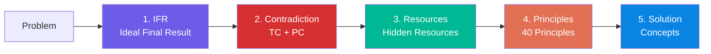

# triz-agents

[한국어 README](README.ko.md)

**The complete Altshuller TRIZ framework as Claude Code skills.**

The first open-source implementation of TRIZ methodology as AI agent skills. No external dependencies — copy the `.claude/` folder into any project and start innovating.

## What is TRIZ?

TRIZ (Theory of Inventive Problem Solving), created by Genrich Altshuller, is a systematic methodology for innovation. By analyzing over 400,000 patents, Altshuller discovered that inventive solutions follow predictable patterns. TRIZ provides tools to find these patterns and solve problems that seem impossible.

> "You can wait 100 years for enlightenment, or you can solve the problem in 15 minutes with these principles." — Altshuller

## Available Tools

### Problem Analysis

| Command | Tool | What it does | Based on |
|---------|------|-------------|----------|
| `/triz "problem"` | **Full Workflow** | IFR → Contradiction → Principles → Resources → Solution | ARIZ-85C |
| `/triz:ifr` | **Ideal Final Result** | Define the perfect solution with zero cost and harm | *And Suddenly the Inventor Appeared* |
| `/triz:contradiction` | **Contradiction Analysis** | Identify technical and physical contradictions | *Creativity as an Exact Science* |

### Solution Generation

| Command | Tool | What it does | Based on |
|---------|------|-------------|----------|
| `/triz:matrix` | **Contradiction Matrix** | Map parameters to recommended principles | 39×39 Matrix |
| `/triz:40p` | **40 Inventive Principles** | Apply principles to resolve contradictions | 40 Principles |
| `/triz:sufield` | **Su-Field Analysis** | Model substance-field interactions and fix them | Su-Field Models |
| `/triz:resources` | **Resource Analysis** | Find hidden resources in the system and environment | ARIZ Part 4 |

### System Design

| Command | Tool | What it does | Based on |
|---------|------|-------------|----------|
| `/triz:trimming` | **Trimming** | Simplify systems by removing components | TRIZ+ / VE |
| `/triz:evolution` | **Evolution Patterns** | Predict next-generation systems using 8 patterns | *Patterns of Evolution* |
| `/triz:ariz` | **ARIZ** | Full algorithmic problem-solving process | ARIZ-85C |

## Installation

### Option 1: Copy into your project

```bash
# Clone this repo
git clone https://github.com/ironyjk/triz-agents.git

# Copy .claude/ folder into your project
cp -r triz-agents/.claude/commands/triz* your-project/.claude/commands/
cp -r triz-agents/.claude/skills/triz your-project/.claude/skills/
```

### Option 2: Use directly

```bash
cd triz-agents
claude   # Start Claude Code in this directory
```

Then invoke any command:
```
/triz "We need to increase throughput but adding equipment increases maintenance costs"
```

## Quick Start

### Resolve a Physical Contradiction

```
/triz:contradiction "How can we make a pipe that's both rigid and flexible?"
```

Output: Technical and physical contradictions with separation strategies.

### Simplify a System

```
/triz:trimming "This machine has 15 components and costs too much"
```

Output: Component ranking by function value, trimming candidates, and redesigned system.

### Full Innovation Analysis

```
/triz "We need to increase throughput but adding equipment increases maintenance costs"
```

Output: Complete ARIZ-based analysis — IFR, contradictions, resources, principles, and solution concepts.

### Predict Technology Evolution

```
/triz:evolution "3D printing technology"
```

Output: Current position on S-curve, applicable evolution patterns, and next-generation predictions.

## How the Full Workflow Works



The full workflow uses a **5-phase sequential pipeline**:

1. **IFR Phase** — Define the ideal: the system achieves its function with zero cost, zero harm, zero complexity
2. **Contradiction Phase** — Identify what prevents reaching the IFR: technical contradictions (IF...THEN...BUT) and physical contradictions (must be A and not-A)
3. **Resources Phase** — Survey all available resources: substance, field, space, time, information, functional
4. **Principles Phase** — Select and apply the most relevant of the 40 Inventive Principles
5. **Solution Phase** — Generate concrete solution concepts ranked by inventive level and feasibility

Each phase builds on the previous. The final report synthesizes everything into actionable solution concepts.

## Output Formats

All tools output in **Mermaid** (default) or **ASCII** format:

```
/triz:contradiction "speed vs accuracy" --format ascii
```

Mermaid diagrams render natively in GitHub, VS Code, and most Markdown viewers.

## Theory Background

See [docs/altshuller-background.md](docs/altshuller-background.md) for a comprehensive overview of Altshuller's life, the development of TRIZ, key publications, and how the methodology spread worldwide.

## Examples

- [Manufacturing Problem](examples/manufacturing-problem.md) — Rigid yet flexible pipes (Contradiction + 40 Principles)
- [Software Architecture](examples/software-architecture.md) — Cached yet real-time web app (IFR + Matrix)
- [Cost Reduction](examples/cost-reduction.md) — Reduce cost without losing quality (Trimming + Resources)
- [Next-Gen Design](examples/next-gen-design.md) — EV battery evolution prediction (Evolution Patterns + S-Curve)

## Roadmap

### v1.0 (Current)
- [x] 3 Problem Analysis tools (Full Workflow, IFR, Contradiction)
- [x] 4 Solution Generation tools (Matrix, 40 Principles, Su-Field, Resources)
- [x] 3 System Design tools (Trimming, Evolution, ARIZ)
- [x] Mermaid + ASCII output
- [x] Full ARIZ-based workflow pipeline

### v2.0 (Planned)
- [ ] **Effects Database** — 8,000+ physical, chemical, and geometric effects for solution generation
- [ ] **Patent Analysis** — Analyze patent databases to extract contradictions and principles
- [ ] **Function Analysis** — Component interaction modeling with function ranking
- [ ] **9-Windows** — Multi-screen (system, supersystem, subsystem × past, present, future)

### v3.0 (Planned)
- [ ] **MCP Server** — Expose TRIZ tools as MCP resources for cross-project use
- [ ] **Interactive Mode** — Step-by-step guided analysis with user input at each phase
- [ ] **TRIZ-TOC Integration** — Combine constraint identification (TOC) with inventive problem solving (TRIZ)
- [ ] **Case Library** — Searchable database of solved problems and applied principles

## Use with /think (30 Tools)

TRIZ works best when combined with other frameworks. Install [strategy-frameworks](https://github.com/ironyjk/strategy-frameworks) to get `/think` — a meta-agent that auto-selects the best tool(s) from 30 frameworks including TRIZ.

```bash
# Install all 30 tools (TOC + TRIZ + 9 strategy frameworks + /think)
curl -fsSL https://raw.githubusercontent.com/ironyjk/strategy-frameworks/master/install.sh | bash
```

## Related Projects

- [strategy-frameworks](https://github.com/ironyjk/strategy-frameworks) — Wardley, OODA, Porter, Blue Ocean, Design Thinking, Drucker, BSC, First Principles + `/think` meta-agent
- [toc-agents](https://github.com/ironyjk/toc-agents) — Theory of Constraints (Goldratt) 11 tools

## Author

**Heechul Choi** — CEO, DY Industrial Development
Co-created with [Claude Code](https://claude.ai/claude-code) (Anthropic Claude Opus 4.6)

## License

[MIT](LICENSE)

## Acknowledgments

- **Genrich Altshuller** (1926-1998) — creator of TRIZ
- The global TRIZ community for decades of research, refinement, and application
- Inspired by [toc-agents](https://github.com/ironyjk/toc-agents) — Theory of Constraints as Claude Code skills
