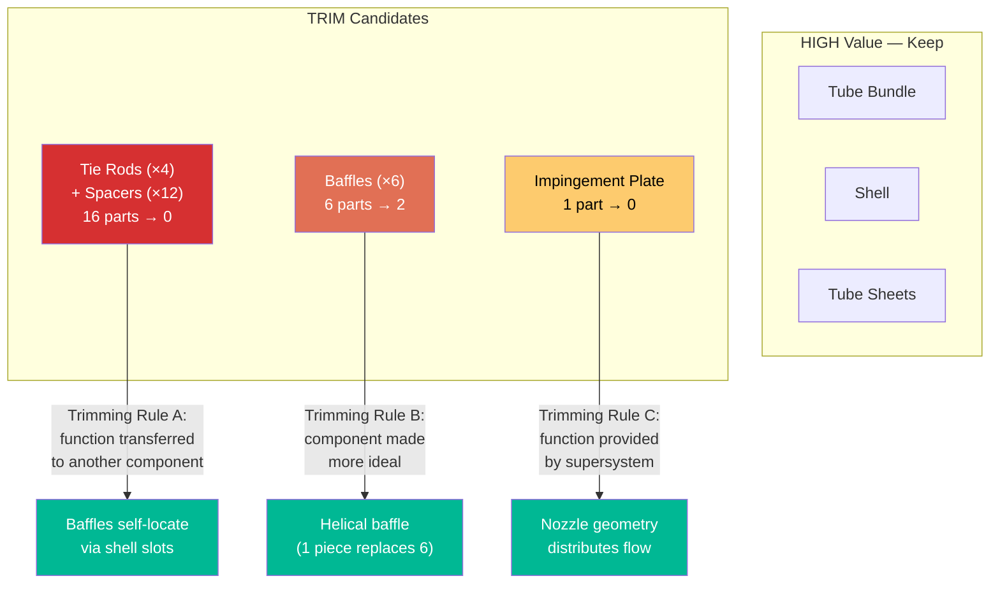
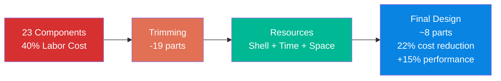

# Cost Reduction: Simplify Without Losing Quality

## The Problem

A small manufacturer produces industrial heat exchangers. Each unit has **23 components** assembled manually. Material cost is acceptable, but assembly labor (40% of total cost) is too high. Customers require the same thermal performance, pressure rating, and 10-year warranty.

Management says "cut costs by 20%." Engineering says "we can't remove anything without losing performance."

## Step 1: Trimming Analysis

```
/triz:trimming "Heat exchanger with 23 components, assembly labor is 40% of total cost, need 20% cost reduction without losing thermal performance or pressure rating"
```

### Component Function Analysis

First, map every component to its function and rank by value (function delivered / cost incurred):

| # | Component | Primary Function | Cost | Function Value |
|---|-----------|-----------------|------|---------------|
| 1 | Tube bundle | Heat transfer | High | **High** (core) |
| 2 | Shell | Contain pressure | High | **High** (core) |
| 3 | Tube sheet (×2) | Seal tubes to shell | Medium | **High** (core) |
| 4 | Baffles (×6) | Direct flow | Low each | Medium |
| 5 | Inlet nozzle | Connect piping | Low | Medium |
| 6 | Outlet nozzle | Connect piping | Low | Medium |
| 7 | Gaskets (×4) | Seal flanges | Low | Medium |
| 8 | Support saddles (×2) | Mount unit | Low | Low |
| 9 | Tie rods (×4) | Hold baffles | Low | **Low** |
| 10 | Spacers (×12) | Space baffles | Low | **Low** |
| 11 | Impingement plate | Protect tubes | Low | Low |
| 12 | Vent/drain connections | Allow maintenance | Low | Low |

### Trimming Candidates



### Trimming Decisions

**Trim 1: Eliminate tie rods and spacers (16 parts → 0)**
- Current function: hold baffles in position
- Transfer function to: shell wall — add stamped grooves/slots in the shell that baffles slot into
- Parts removed: 16
- Assembly steps removed: 8 (insert rods, thread spacers, tighten)

**Trim 2: Replace 6 segmental baffles with 1 helical baffle**
- Current: 6 flat plate baffles, each positioned by tie rods
- Replace with: single helical (spiral) baffle strip
- Bonus: helical flow reduces pressure drop 30% and improves heat transfer 15%
- Parts reduced: 6 → 1

**Trim 3: Eliminate impingement plate**
- Current function: protect first row of tubes from inlet jet
- Transfer to: redesign inlet nozzle with diffuser geometry (flared entry)
- Parts removed: 1

### Trimming Result

| Metric | Before | After | Change |
|--------|--------|-------|--------|
| Total components | 23 | 6 (core) + trimmed | -19 parts |
| Assembly steps | 34 | 18 | -47% |
| Assembly labor | 40% of cost | 22% of cost | **-45% labor** |
| Total unit cost | 100% | 78% | **-22% cost** |
| Thermal performance | Baseline | +15% (helical) | Improved |
| Pressure drop | Baseline | -30% (helical) | Improved |

## Step 2: Resource Analysis

```
/triz:resources "What existing resources in the heat exchanger system can we leverage to further reduce cost?"
```

### Hidden Resources Found

| Resource Type | Resource | Current State | How to Use |
|---------------|----------|---------------|------------|
| **Substance** | Shell wall material | Passive container | Active: stamp baffle guides directly into shell wall |
| **Shape** | Tube layout pattern | Triangular pitch (standard) | Optimize pitch for helical flow — fewer tubes, same performance |
| **Process** | Welding heat | Wasted after joining | Use residual heat for post-weld stress relief (eliminate separate furnace step) |
| **Information** | Thermal gradient | Unmeasured | Add thermochromic paint to shell — instant visual QC (no testing equipment) |
| **Time** | Assembly sequence | Serial | Parallel: sub-assemble tube bundle while shell is being rolled |
| **Space** | Inside of support saddles | Empty/hollow | Route vent/drain lines through saddle — eliminate 2 separate connections |

### Resource Application

**Resource 1: Shell wall as baffle guide (Substance resource)**
The shell wall already surrounds the baffles. Instead of tie rods holding baffles in place from inside, stamp guide slots into the shell wall before rolling. The baffles slide into pre-cut positions during assembly. Zero additional parts.

**Resource 2: Parallel assembly (Time resource)**
Currently: roll shell → insert tube bundle → weld tube sheets → attach nozzles → install baffles → test.
Redesign: while the shell is being rolled and welded, simultaneously assemble the tube bundle with helical baffle on a separate fixture. Drop-in assembly. Saves 2 hours per unit.

**Resource 3: Saddle routing (Space resource)**
Support saddles are hollow steel structures. Route the vent and drain connections through the saddle body, eliminating 2 separate nozzle welds and 2 gaskets.

## Solution Summary



### Key Insight

The engineering team was right that you "can't remove anything without losing performance" — if you think about removing components one at a time. Trimming works differently: it **transfers functions** from low-value components to high-value ones. The shell, which was just a pressure container, now also guides baffles and routes connections. The single helical baffle replaces 6 flat baffles plus 16 support parts.

The result: fewer parts, lower cost, and paradoxically **better** thermal performance — because the helical flow pattern is inherently superior to segmental baffle flow. This is typical of high-quality TRIZ solutions: the contradiction between cost and performance dissolves rather than being compromised.

**Inventive Level:** 2-3 (known solution applied in a new combination within the field)

**Recommended next step:** `/triz:evolution` to identify which evolution patterns (mono-bi-poly, dynamization, transition to micro-level) could drive the next generation of this heat exchanger design.
