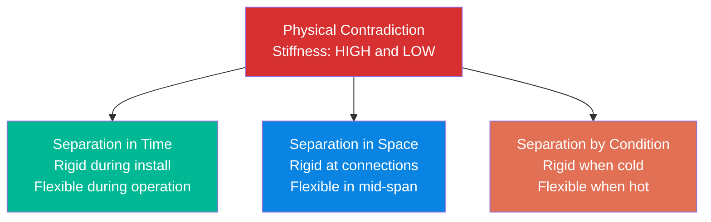
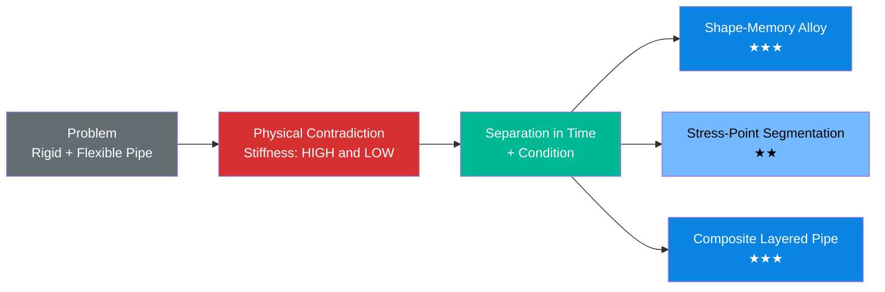

# Manufacturing Problem: Rigid Yet Flexible Pipes

## The Problem

A chemical plant needs piping that is **rigid during installation** (to maintain precise alignment with flanges, supports, and equipment) but **flexible during operation** (to absorb thermal expansion, vibration, and ground settlement without cracking).

Current solutions — expansion joints, bellows, flexible hoses — add components, leak points, and maintenance burden. Can we solve this without adding parts?

## Step 1: Contradiction Analysis

```
/triz:contradiction "Pipes must be rigid during installation for precise alignment, but flexible during operation to absorb thermal expansion and vibration"
```

### Technical Contradiction (TC)

```
IF we make the pipe rigid,
THEN installation alignment is precise and joints seal properly,
BUT the pipe cracks under thermal expansion and vibration.

IF we make the pipe flexible,
THEN it absorbs thermal movement without damage,
BUT installation alignment is poor and connections leak.
```

**Improving parameter:** #11 Stress/Pressure (ability to handle thermal stress)
**Worsening parameter:** #13 Stability of Object's Composition (structural rigidity, alignment)

### Physical Contradiction (PC)

```
The pipe's stiffness must be HIGH (rigid) during installation
AND must be LOW (flexible) during operation.
```

**Intensification:** The pipe should be infinitely rigid during bolt-up (zero deflection) and infinitely flexible during thermal cycling (zero stress).

### Separation Strategy

This is a classic **separation in time** — the requirements apply at different moments:
- Installation phase: rigid
- Operation phase: flexible



## Step 2: Apply 40 Inventive Principles

```
/triz:40p "Pipe stiffness must be high during installation and low during operation"
```

### Recommended Principles

| # | Principle | Application | Feasibility |
|---|-----------|-------------|-------------|
| **35** | **Parameter Changes** | Use a material whose stiffness changes with temperature — rigid at ambient (installation), softens at operating temperature | High |
| **15** | **Dynamics** | Replace a rigid pipe with segments connected by joints that lock during installation and unlock during operation | Medium |
| **1** | **Segmentation** | Divide the pipe into rigid segments with flexible connectors — but only at calculated stress points, not uniformly | High |
| **36** | **Phase Transitions** | Use a pipe filled with a substance that freezes during installation (providing rigidity) and melts during operation (allowing flex) | Medium |
| **40** | **Composite Materials** | Fiber-reinforced polymer with oriented fibers — rigid in axial direction (alignment), flexible in radial direction (thermal) | High |

### Top Solution Concepts

#### Concept A: Shape-Memory Alloy Pipe (Principle #35 — Parameter Changes)

Use a nickel-titanium (NiTi) alloy pipe section at critical stress points. At room temperature during installation, the alloy is in its martensite phase — rigid and precisely formable. At operating temperature (above transition point), it transforms to austenite — superelastic, absorbing strain up to 8% without permanent deformation.

**Inventive Level:** 3 (solution from adjacent field — biomedical to industrial piping)

#### Concept B: Stress-Point Segmentation (Principle #1 — Segmentation)

Instead of uniform pipe with separate expansion joints, engineer **calculated flex zones** directly into the pipe wall. Reduce wall thickness or change geometry (corrugations) only at the 3-4 points of maximum thermal stress. The rest of the pipe remains standard rigid pipe.

**Inventive Level:** 2 (improvement within the field)

#### Concept C: Composite Layered Pipe (Principle #40 — Composite Materials)

A dual-layer pipe: outer layer of rigid carbon fiber (handles installation loads, maintains alignment), inner layer of flexible elastomer (handles thermal expansion). The rigid layer carries structural loads during installation. During operation, thermal expansion is absorbed by differential movement between layers.

**Inventive Level:** 3 (cross-domain solution)

## Solution Summary



**Recommended next step:** `/triz:resources` to identify what existing materials, fields, and spatial resources in the plant can be leveraged to implement Concept B (lowest cost) or Concept A (highest inventive level).
