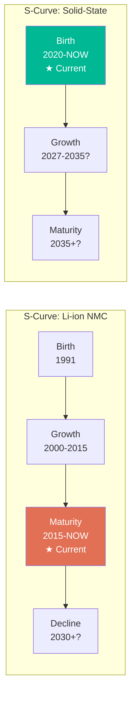
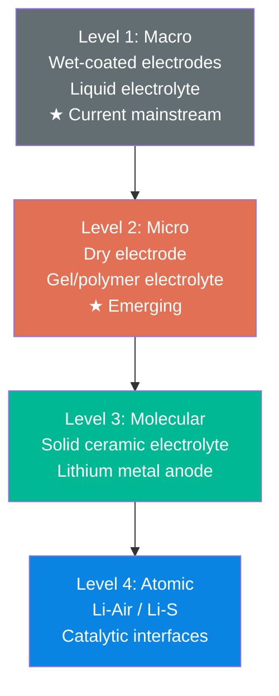
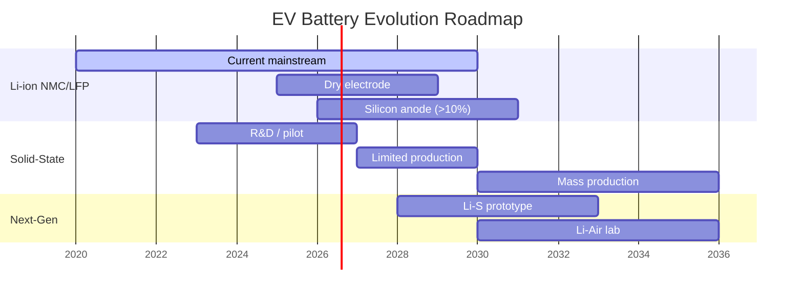

# Next-Gen Design: Electric Vehicle Battery Evolution

## The Problem

An EV startup needs to plan its battery technology roadmap for the next 10 years. Current lithium-ion cells are mature — incremental improvements in energy density are slowing. What comes next? When should they invest in new chemistries? How do they avoid betting on the wrong technology?

## Evolution Analysis

```
/triz:evolution "Electric vehicle battery technology"
```

### S-Curve Position



**Diagnosis:** Li-ion NMC/NCA batteries are in **late maturity**. Key indicators:

| S-Curve Indicator | Evidence |
|-------------------|----------|
| Performance gains slowing | Energy density improvement dropped from 8%/year to 3%/year |
| Increasing complexity for marginal gains | Silicon-anode, dry electrode, CTP — each adds complexity for 5-10% improvement |
| Number of patents peaked | Li-ion patent filings peaked ~2018, now declining |
| Competitors converging on similar specs | All major cells cluster around 250-300 Wh/kg |
| Focus shifting to cost/manufacturing | Innovation now in production (dry electrode, CTP) not chemistry |

### 8 Evolution Patterns Applied

#### Pattern 1: Transition to Supersystem

> The battery merges with the vehicle structure.

**Current state:** Battery is a separate component (pack → module → cell), mounted to chassis.

**Next evolution:** Structural battery — the battery case IS the vehicle floor. Cells are integrated into the body structure, carrying mechanical loads.

**Evidence:** Tesla's structural pack (2021), BYD's Cell-to-Body, CATL's CTC (Cell-to-Chassis).

**Prediction:** By 2028, the concept of a "battery pack" as a removable component will be obsolete in new designs. The battery will be the chassis.

#### Pattern 2: Transition to Micro-Level

> From macro-assembly to molecular/atomic-level engineering.

**Current state:** Electrode materials are coated onto foils (macro manufacturing).

**Next evolution:**
1. **Near-term (2026-2028):** Dry electrode coating — eliminate solvent, simplify manufacturing
2. **Mid-term (2028-2032):** Solid-state electrolyte — replace liquid with ceramic/polymer at molecular level
3. **Long-term (2032+):** Lithium-air or lithium-sulfur — electrochemistry at atomic level



#### Pattern 3: Increasing Dynamization

> From rigid/static to flexible/adaptive.

**Current state:** Fixed chemistry, fixed voltage, fixed thermal management.

**Next evolution:**
- **Adaptive BMS:** AI-driven battery management that adjusts charging curves per cell based on degradation state
- **Hybrid packs:** Mix high-energy cells (highway) with high-power cells (city) in one pack, dynamically routing current
- **Self-healing electrolytes:** Materials that repair dendrite damage autonomously

#### Pattern 4: Mono-Bi-Poly

> From single to multiple to combined.

**Current state:** Single chemistry per pack (all NMC or all LFP).

**Next evolution:**
- **Bi-chemistry packs:** LFP core (cheap, safe, long-life) + NMC perimeter (high energy for range) — CATL's AB battery
- **Poly-chemistry:** Different chemistries for different vehicle zones (front crash-safe = LFP, floor = solid-state, range extender = Li-S)

#### Pattern 5: Increasing Ideality

> More function, less material, less cost, less harm.

| Generation | Energy Density | Cost | Safety | Materials |
|------------|---------------|------|--------|-----------|
| Gen 1 (2015) | 150 Wh/kg | $300/kWh | Cooling required | Cobalt-heavy |
| Gen 2 (2020) | 250 Wh/kg | $130/kWh | Improved | Low-cobalt |
| Gen 3 (2025) | 300 Wh/kg | $90/kWh | CTP/BMS advances | Cobalt-free (LFP) |
| Gen 4 (2030) | 500 Wh/kg | $60/kWh | Inherently safe | Solid-state |
| Gen 5 (2035+) | 800+ Wh/kg | $40/kWh | Self-healing | Li-Air |

**Ideal Final Result:** The battery has infinite energy density, zero cost, zero weight, zero degradation, charges instantly, and is made from abundant non-toxic materials. Each generation moves closer to this IFR.

### Technology Roadmap



### Strategic Recommendations

| Timeframe | Action | Rationale (Evolution Pattern) |
|-----------|--------|------------------------------|
| **Now - 2027** | Optimize Li-ion: CTP/CTB, dry electrode, silicon anode | Maturity phase — extract remaining value through manufacturing innovation |
| **2026 - 2028** | Partner with solid-state developer, build pilot line | Growth phase of next S-curve — be ready for transition |
| **2027 - 2030** | Dual-chemistry pack architecture | Mono-Bi-Poly pattern — bridge between Li-ion and solid-state |
| **2028+** | Structural battery integration | Supersystem transition — differentiation through vehicle-level integration |
| **2030+** | Full solid-state production | New S-curve growth phase — cost parity with Li-ion |

### Key Insight

TRIZ evolution patterns show that EV batteries are following the same trajectory as every technology before them. The patterns are not speculative — they are structural laws observed across thousands of technological systems. The transition from Li-ion to solid-state is not a question of "if" but "when," and the S-curve analysis gives us timing. The company that rides the new S-curve from early growth — not too early (birth-phase risk) and not too late (maturity-phase commodity) — captures the most value.

**Inventive Level:** 4 — solution outside the original field (applying technology evolution forecasting to strategic planning)

**Recommended next step:** `/triz:contradiction` to analyze the specific technical contradictions in solid-state batteries (e.g., ionic conductivity vs. mechanical stability of ceramic electrolytes) and find inventive solutions that could accelerate the transition.
