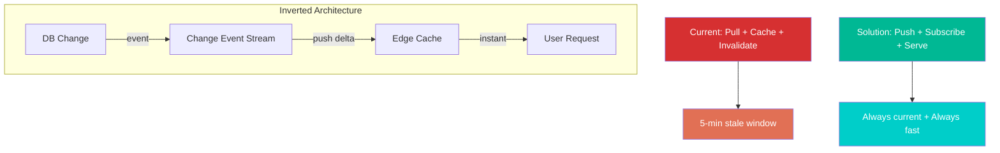

# Software Architecture: Cached Yet Real-Time

## The Problem

A web application serves product catalog data to millions of users. The data **must be fast** (sub-50ms response) to maintain user experience and SEO rankings. But the data **must be current** (prices, stock levels, promotions change every few minutes) to avoid displaying stale information that leads to order errors and customer complaints.

Aggressive caching makes it fast but stale. Bypassing cache makes it current but slow. Current architecture uses a 5-minute TTL cache as a compromise — and everyone is unhappy.

## Step 1: Ideal Final Result

```
/triz:ifr "Web app needs to serve product data that is both instantly fast and always current"
```

### IFR Statement

> The data **itself** is always current at the moment of request, without any caching mechanism, without any latency, and without any additional infrastructure cost.

### Ideal System Characteristics

- The system delivers current data with zero latency
- No separate cache layer exists (zero components to maintain)
- No cache invalidation logic exists (zero complexity)
- The data "knows" when it has changed and updates itself at the point of consumption

### Gap Analysis

| IFR Attribute | Current Reality | Gap |
|---------------|----------------|-----|
| Zero latency | 50ms cached / 800ms uncached | Need to eliminate DB query time |
| Always current | 5-min TTL (stale window) | Need instant propagation |
| Zero infrastructure | Redis cluster + CDN + DB | 3 layers to maintain |
| Self-updating | Manual invalidation | Need automatic propagation |

## Step 2: Contradiction Analysis

```
/triz:contradiction "Data must be pre-computed (cached) for speed AND must be fetched live for freshness"
```

### Technical Contradiction

```
IF we cache aggressively (long TTL, pre-computed),
THEN response time is fast (sub-50ms),
BUT data is stale (up to 5 minutes old).

IF we bypass cache (short TTL, live queries),
THEN data is always current,
BUT response time is slow (800ms+).
```

**Improving:** #9 Speed
**Worsening:** #28 Measurement Accuracy (data accuracy/freshness)

### Physical Contradiction

```
Cache TTL must be LONG (for speed)
AND must be SHORT (for freshness).

Intensified: TTL must be INFINITE (pre-computed, never expires)
AND TTL must be ZERO (every request hits the source).
```

## Step 3: Contradiction Matrix

```
/triz:matrix "Speed (#9) vs Measurement Accuracy (#28)"
```

### Matrix Lookup

| Improving | Worsening | Recommended Principles |
|-----------|-----------|----------------------|
| #9 Speed | #28 Measurement Accuracy | **32, 28, 13, 18** |

### Principle Analysis

| # | Principle | Application to This Problem |
|---|-----------|---------------------------|
| **32** | **Color Changes** (Feedback/Signaling) | Data signals its own staleness — items mark themselves as "changed" and push updates only for what changed |
| **28** | **Mechanics Substitution** (Replace the mechanism) | Replace pull-based cache (request → check → maybe fetch) with push-based cache (change → push → already there) |
| **13** | **The Other Way Around** (Inversion) | Instead of the client pulling data and caching it, the data pushes itself to the client when it changes |
| **18** | **Mechanical Vibration** (Resonance) | Tune update frequency to match actual change frequency — high-change items get real-time push, low-change items keep long cache |

### Solution Synthesis

All four principles converge on the same insight: **invert the data flow**. Don't cache-then-invalidate. Push-then-serve.



## Solution: Event-Driven Cache with Differential Push

### Architecture

1. **Database triggers** emit change events for every product update (Principle #32 — data signals its own change)
2. **Event stream** (Kafka/Redis Streams) carries only the changed fields, not full records (Principle #13 — inversion from pull to push)
3. **Edge caches** subscribe to the stream and apply deltas in real-time (Principle #28 — replace polling with streaming)
4. **Smart TTL** per data field: price/stock = real-time push, description/images = 1-hour TTL (Principle #18 — match frequency to change rate)

### Result

| Metric | Before | After |
|--------|--------|-------|
| Response time | 50ms (cached) / 800ms (miss) | 10ms (always cached, always current) |
| Staleness window | 0-5 minutes | 0-100ms (event propagation delay) |
| Cache hit rate | 85% | 99.9% (never expires, only updates) |
| Infrastructure | Redis cluster + TTL logic + invalidation code | Event stream + edge subscriber |
| Cache invalidation bugs | Weekly | Zero (no invalidation — only updates) |

### Why This Works (TRIZ Perspective)

The physical contradiction "TTL must be infinite AND zero" is resolved by **separation by condition**:

- **TTL is infinite** — cached data never expires, so it's always fast
- **TTL is zero** — but the cached data is updated in real-time via push, so it's always current

The cache becomes a **live replica** rather than a snapshot. The contradiction dissolves because we eliminated the concept of "invalidation" entirely. Data is not cached-then-invalidated; it is replicated-then-updated.

**Inventive Level:** 3 — solution imported from distributed systems (database replication) into application caching.

**Recommended next step:** `/triz:evolution` to analyze where this architecture sits on the technology S-curve and predict future evolution (edge computing, CRDTs, local-first).
